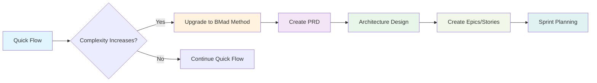

# BMAD Quick Flow

**Track:** Quick Flow
**Primary Agent:** Quick Flow Solo Dev (Barry)
**Ideal For:** Bug fixes, small features, rapid prototyping

---

## Overview

BMAD Quick Flow is the fastest path from idea to production in the BMAD Method ecosystem. It's a streamlined 3-step process designed for rapid spec driven development without sacrificing quality. Perfect for experienced teams who need to move fast or for smaller features or 1 off efforts that don't require extensive planning.

### When to Use Quick Flow

**Perfect For:**

- Bug fixes and patches
- Small feature additions
- Proof of concepts and prototypes
- Mid course corrections or additions of something missed in BMM full planning
- Performance optimizations
- API endpoint additions
- UI component enhancements
- Configuration changes
- Internal tools

**Not Recommended For:**

- Large-scale system redesigns
- Complex multi-team projects
- New product launches
- Projects requiring extensive UX design
- Enterprise-wide initiatives
- Mission-critical systems with compliance requirements
- Ideas with many 'moving pieces'

---

## The Quick Flow Process

Utilizing the Quick Flow Solo Dev, this one agent can do it all!

1. Create an (option) Technical Specification
2. Develop with Tests
3. AI Driven Code Review

That's it! Lets look at each step in more detail though.

### Step 1: Optional Technical Specification

The `create-tech-spec` workflow transforms requirements into implementation-ready specifications.

**Key Features:**

- Conversational spec engineering
- Automatic codebase pattern detection
- Context gathering from existing code
- Implementation-ready task breakdown
- Acceptance criteria definition

**Process Flow:**

1. **Problem Understanding**
   - Greet user and gather requirements
   - Ask clarifying questions about scope and constraints
   - Check for existing project context

2. **Code Investigation (Brownfield)**
   - Analyze existing codebase patterns
   - Document tech stack and conventions
   - Identify files to modify and dependencies

3. **Specification Generation**
   - Create structured tech specification
   - Define clear tasks and acceptance criteria
   - Document technical decisions
   - Include development context

4. **Review and Finalize**
   - Present spec for validation
   - Make adjustments as needed
   - Save to sprint artifacts

**Output:** `{implementation_artifacts}/tech-spec-{slug}.md`

### Step 2: Development

The `quick-dev` workflow executes implementation with flexibility and speed.

**Two Execution Modes:**

**Mode A: Tech-Spec Driven**

```bash
# Execute from tech spec
quick-dev tech-spec-feature-x.md
```

- Loads and parses technical specification
- Extracts tasks, context, and acceptance criteria
- Executes all tasks in sequence
- Updates spec status on completion

**Mode B: Direct Instructions**

```bash
# Direct development commands
quick-dev "Add password reset to auth service"
quick-dev "Fix the memory leak in image processing"
```

- Accepts direct development instructions
- Offers optional planning step
- Executes immediately with minimal friction

**Development Process:**

1. **Context Loading**
   - Load project context if available
   - Understand patterns and conventions
   - Identify relevant files and dependencies

2. **Implementation Loop**
   For each task:
   - Load relevant files and context
   - Implement following established patterns
   - Write appropriate tests
   - Run and verify tests pass
   - Mark task complete and continue

3. **Continuous Execution**
   - Works through all tasks without stopping
   - Handles failures by requesting guidance
   - Ensures tests pass before continuing

4. **Verification**
   - Confirms all tasks complete
   - Validates acceptance criteria
   - Updates tech spec status if used

### Step 3: Optional Code Review

The `code-review` workflow provides senior developer review of implemented code.

**When to Use:**

- Production-critical features
- Security-sensitive implementations
- Performance optimizations
- Team development scenarios
- Learning and knowledge transfer

**Review Process:**

1. Load story context and acceptance criteria
2. Analyze code implementation
3. Check against project patterns
4. Validate test coverage
5. Provide structured review notes
6. Suggest improvements if needed

---

## Quick Flow vs Other Tracks

| Aspect            | Quick Flow       | BMad Method     | Enterprise Method  |
| ----------------- | ---------------- | --------------- | ------------------ |
| **Planning**      | Minimal/Optional | Structured      | Comprehensive      |
| **Documentation** | Essential only   | Moderate        | Extensive          |
| **Team Size**     | 1-2 developers   | 3-7 specialists | 8+ enterprise team |
| **Timeline**      | Hours to days    | Weeks to months | Months to quarters |
| **Ceremony**      | Minimal          | Balanced        | Full governance    |
| **Flexibility**   | High             | Moderate        | Structured         |
| **Risk Profile**  | Medium           | Low             | Very Low           |

---

## Best Practices

### Before Starting Quick Flow

1. **Validate Track Selection**
   - Is the feature small enough?
   - Do you have clear requirements?
   - Is the team comfortable with rapid development?

2. **Prepare Context**
   - Have project documentation ready
   - Know your codebase patterns
   - Identify affected components upfront

3. **Set Clear Boundaries**
   - Define in-scope and out-of-scope items
   - Establish acceptance criteria
   - Identify dependencies

### During Development

1. **Maintain Velocity**
   - Don't over-engineer solutions
   - Follow existing patterns
   - Keep tests proportional to risk

2. **Stay Focused**
   - Resist scope creep
   - Handle edge cases later if possible
   - Document decisions briefly

3. **Communicate Progress**
   - Update task status regularly
   - Flag blockers immediately
   - Share learning with team

### After Completion

1. **Quality Gates**
   - Ensure tests pass
   - Verify acceptance criteria
   - Consider optional code review

2. **Knowledge Transfer**
   - Update relevant documentation
   - Share key decisions
   - Note any discovered patterns

3. **Production Readiness**
   - Verify deployment requirements
   - Check monitoring needs
   - Plan rollback strategy

---

## Quick Flow Templates

### Tech Spec Template

```markdown
# Tech-Spec: {Feature Title}

**Created:** {date}
**Status:** Ready for Development
**Estimated Effort:** Small (1-2 days)

## Overview

### Problem Statement

{Clear description of what needs to be solved}

### Solution

{High-level approach to solving the problem}

### Scope (In/Out)

**In:** {What will be implemented}
**Out:** {Explicitly excluded items}

## Context for Development

### Codebase Patterns

{Key patterns to follow, conventions}

### Files to Reference

{List of relevant files and their purpose}

### Technical Decisions

{Important technical choices and rationale}

## Implementation Plan

### Tasks

- [ ] Task 1: {Specific implementation task}
- [ ] Task 2: {Specific implementation task}
- [ ] Task 3: {Testing and validation}

### Acceptance Criteria

- [ ] AC 1: {Given/When/Then format}
- [ ] AC 2: {Given/When/Then format}

## Additional Context

### Dependencies

{External dependencies or prerequisites}

### Testing Strategy

{How the feature will be tested}

### Notes

{Additional considerations}
```

### Quick Dev Commands

```bash
# From tech spec
quick-dev sprint-artifacts/tech-spec-user-auth.md

# Direct development
quick-dev "Add CORS middleware to API endpoints"
quick-dev "Fix null pointer exception in user service"
quick-dev "Optimize database query for user list"

# With optional planning
quick-dev "Implement file upload feature" --plan
```

---

## Integration with Other Workflows

### Upgrading Tracks

If a Quick Flow feature grows in complexity:



### Using Party Mode

For complex Quick Flow challenges:

```bash
# Start Barry
/bmad:bmm:agents:quick-flow-solo-dev

# Begin party mode for collaborative problem-solving
party-mode
```

Party mode brings in relevant experts:

- **Architect** - For design decisions
- **Dev** - For implementation pairing
- **QA** - For test strategy
- **UX Designer** - For user experience
- **Analyst** - For requirements clarity

### Quality Assurance Integration

Quick Flow can integrate with TEA agent for automated testing:

- Test case generation
- Automated test execution
- Coverage analysis
- Test healing

---

## Common Quick Flow Scenarios

### Scenario 1: Bug Fix

```
Requirement: "Users can't reset passwords"
Process: Direct development (no spec needed)
Steps: Investigate → Fix → Test → Deploy
Time: 2-4 hours
```

### Scenario 2: Small Feature

```
Requirement: "Add export to CSV functionality"
Process: Tech spec → Development → Code review
Steps: Spec → Implement → Test → Review → Deploy
Time: 1-2 days
```

### Scenario 3: Performance Fix

```
Requirement: "Optimize slow product search query"
Process: Tech spec → Development → Review
Steps: Analysis → Optimize → Benchmark → Deploy
Time: 1 day
```

### Scenario 4: API Addition

```
Requirement: "Add webhook endpoints for integrations"
Process: Tech spec → Development → Review
Steps: Design → Implement → Document → Deploy
Time: 2-3 days
```

---

## Metrics and KPIs

Track these metrics to ensure Quick Flow effectiveness:

**Velocity Metrics:**

- Features completed per week
- Average cycle time (hours)
- Bug fix resolution time
- Code review turnaround

**Quality Metrics:**

- Defect escape rate
- Test coverage percentage
- Production incident rate
- Code review findings

**Team Metrics:**

- Developer satisfaction
- Knowledge sharing frequency
- Process adherence
- Autonomy index

---

## Troubleshooting Quick Flow

### Common Issues

**Issue: Scope creep during development**
**Solution:** Refer back to tech spec, explicitly document new requirements

**Issue: Unknown patterns or conventions**
**Solution:** Use party-mode to bring in architect or senior dev

**Issue: Testing bottleneck**
**Solution:** Leverage TEA agent for automated test generation

**Issue: Integration conflicts**
**Solution:** Document dependencies, coordinate with affected teams

### Emergency Procedures

**Production Hotfix:**

1. Create branch from production
2. Quick dev with minimal changes
3. Deploy to staging
4. Quick regression test
5. Deploy to production
6. Merge to main

**Critical Bug:**

1. Immediate investigation
2. Party-mode if unclear
3. Quick fix with rollback plan
4. Post-mortem documentation

---

## Related Documentation

- **[Quick Flow Solo Dev Agent](./quick-flow-solo-dev.md)** - Primary agent for Quick Flow
- **[Agents Guide](./agents-guide.md)** - Complete agent reference
- **[Scale Adaptive System](./scale-adaptive-system.md)** - Track selection guidance
- **[Party Mode](./party-mode.md)** - Multi-agent collaboration
- **[Workflow Implementation](./workflows-implementation.md)** - Implementation details

---

## FAQ

**Q: How do I know if my feature is too big for Quick Flow?**
A: If it requires more than 3-5 days of work, affects multiple systems significantly, or needs extensive UX design, consider the BMad Method track.

**Q: Can I switch from Quick Flow to BMad Method mid-development?**
A: Yes, you can upgrade. Create the missing artifacts (PRD, architecture) and transition to sprint-based development.

**Q: Is Quick Flow suitable for production-critical features?**
A: Yes, with code review. Quick Flow doesn't sacrifice quality, just ceremony.

**Q: How do I handle dependencies between Quick Flow features?**
A: Document dependencies clearly, consider batching related features, or upgrade to BMad Method for complex interdependencies.

**Q: Can junior developers use Quick Flow?**
A: Yes, but they may benefit from the structure of BMad Method. Quick Flow assumes familiarity with patterns and autonomy.

---

**Ready to ship fast?** → Start with `/bmad:bmm:agents:quick-flow-solo-dev`
