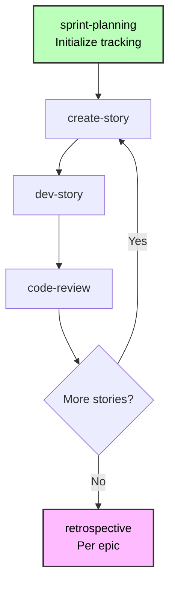
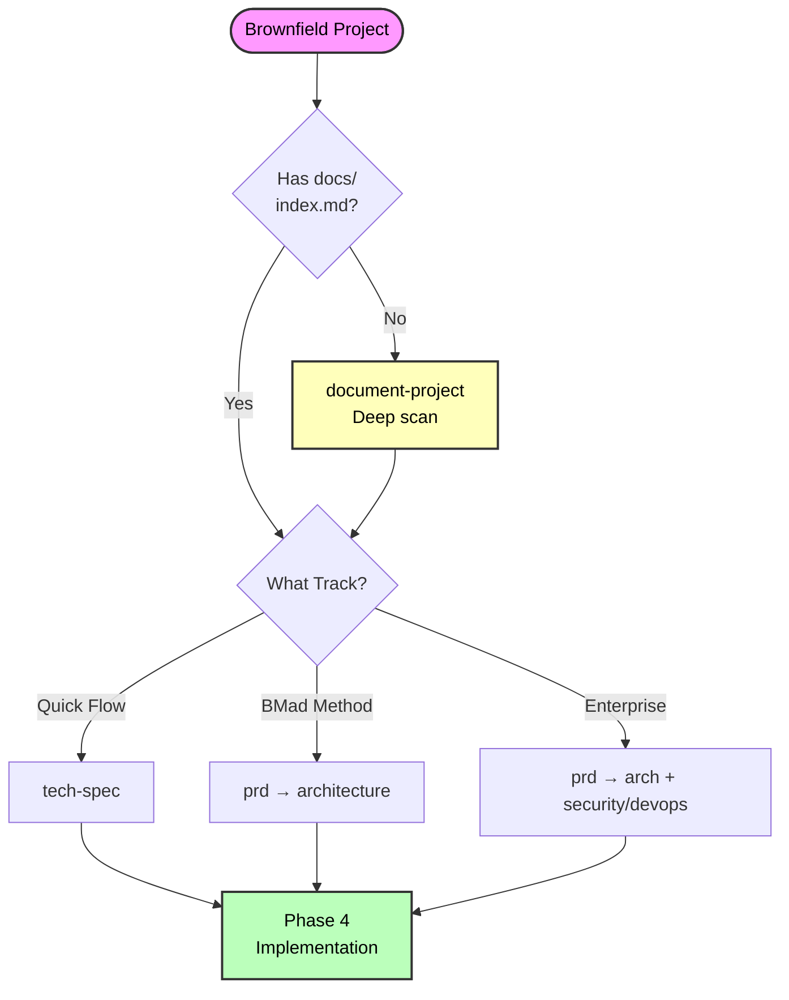

# BMad Method Brownfield Development Guide

**Complete guide for working with existing codebases**

**Reading Time:** ~35 minutes

---

## Quick Navigation

**Jump to:**

- [Quick Reference](#quick-reference) - Commands and files
- [Common Scenarios](#common-scenarios) - Real-world examples
- [Best Practices](#best-practices) - Success tips

---

## What is Brownfield Development?

Brownfield projects involve working within existing codebases rather than starting fresh:

- **Bug fixes** - Single file changes
- **Small features** - Adding to existing modules
- **Feature sets** - Multiple related features
- **Major integrations** - Complex architectural additions
- **System expansions** - Enterprise-scale enhancements

**Key Difference from Greenfield:** You must understand and respect existing patterns, architecture, and constraints.

**Core Principle:** AI agents need comprehensive documentation to understand existing code before they can effectively plan or implement changes.

---

## Getting Started

### Understanding Planning Tracks

For complete track details, see [Scale Adaptive System](./scale-adaptive-system.md).

**Brownfield tracks at a glance:**

| Track                 | Scope                      | Typical Stories | Key Difference                                  |
| --------------------- | -------------------------- | --------------- | ----------------------------------------------- |
| **Quick Flow**        | Bug fixes, small features  | 1-15            | Must understand affected code and patterns      |
| **BMad Method**       | Feature sets, integrations | 10-50+          | Integrate with existing architecture            |
| **Enterprise Method** | Enterprise expansions      | 30+             | Full system documentation + compliance required |

**Note:** Story counts are guidance, not definitions. Tracks are chosen based on planning needs.

### Track Selection for Brownfield

When you run `workflow-init`, it handles brownfield intelligently:

**Step 1: Shows what it found**

- Old planning docs (PRD, epics, stories)
- Existing codebase

**Step 2: Asks about YOUR work**

> "Are these works in progress, previous effort, or proposed work?"

- **(a) Works in progress** → Uses artifacts to determine level
- **(b) Previous effort** → Asks you to describe NEW work
- **(c) Proposed work** → Uses artifacts as guidance
- **(d) None of these** → You explain your work

**Step 3: Analyzes your description**

- Keywords: "fix", "bug" → Quick Flow, "dashboard", "platform" → BMad Method, "enterprise", "multi-tenant" → Enterprise Method
- Complexity assessment
- Confirms suggested track with you

**Key Principle:** System asks about YOUR current work first, uses old artifacts as context only.

**Example: Old Complex PRD, New Simple Work**

```
System: "Found PRD.md (BMad Method track, 30 stories, 6 months old)"
System: "Is this work in progress or previous effort?"
You: "Previous effort - I'm just fixing a bug now"
System: "Tell me about your current work"
You: "Update payment method enums"
System: "Quick Flow track (tech-spec approach). Correct?"
You: "Yes"
✅ Creates Quick Flow workflow
```

---

## Documentation: Critical First Step

🚨 **For brownfield projects: Always ensure adequate AI-usable documentation before planning**

### Default Recommendation: Run document-project

**Best practice:** Run `document-project` workflow unless you have **confirmed, trusted, AI-optimized documentation**.

### Why Document-Project is Almost Always the Right Choice

Existing documentation often has quality issues that break AI workflows:

**Common Problems:**

- **Too Much Information (TMI):** Massive markdown files with 10s or 100s of level 2 sections
- **Out of Date:** Documentation hasn't been updated with recent code changes
- **Wrong Format:** Written for humans, not AI agents (lacks structure, index, clear patterns)
- **Incomplete Coverage:** Missing critical architecture, patterns, or setup info
- **Inconsistent Quality:** Some areas documented well, others not at all

**Impact on AI Agents:**

- AI agents hit token limits reading massive files
- Outdated docs cause hallucinations (agent thinks old patterns still apply)
- Missing structure means agents can't find relevant information
- Incomplete coverage leads to incorrect assumptions

### Documentation Decision Tree

**Step 1: Assess Existing Documentation Quality**

Ask yourself:

- ✅ Is it **current** (updated in last 30 days)?
- ✅ Is it **AI-optimized** (structured with index.md, clear sections, <500 lines per file)?
- ✅ Is it **comprehensive** (architecture, patterns, setup all documented)?
- ✅ Do you **trust** it completely for AI agent consumption?

**If ANY answer is NO → Run `document-project`**

**Step 2: Check for Massive Documents**

If you have documentation but files are huge (>500 lines, 10+ level 2 sections):

1. **First:** Run `shard-doc` tool to split large files:

   ```bash
   # Load BMad Master or any agent
   _bmad/core/tools/shard-doc.xml --input docs/massive-doc.md
   ```

   - Splits on level 2 sections by default
   - Creates organized, manageable files
   - Preserves content integrity

2. **Then:** Run `index-docs` task to create navigation:

   ```bash
   _bmad/core/tasks/index-docs.xml --directory ./docs
   ```

3. **Finally:** Validate quality - if sharded docs still seem incomplete/outdated → Run `document-project`

### Four Real-World Scenarios

| Scenario | You Have                                   | Action                     | Why                                     |
| -------- | ------------------------------------------ | -------------------------- | --------------------------------------- |
| **A**    | No documentation                           | `document-project`         | Only option - generate from scratch     |
| **B**    | Docs exist but massive/outdated/incomplete | `document-project`         | Safer to regenerate than trust bad docs |
| **C**    | Good docs but no structure                 | `shard-doc` → `index-docs` | Structure existing content for AI       |
| **D**    | Confirmed AI-optimized docs with index.md  | Skip Documentation         | Rare - only if you're 100% confident    |

### Scenario A: No Documentation (Most Common)

**Action: Run document-project workflow**

1. Load Analyst or Technical Writer (Paige) agent
2. Run `*document-project`
3. Choose scan level:
   - **Quick** (2-5min): Pattern analysis, no source reading
   - **Deep** (10-30min): Reads critical paths - **Recommended**
   - **Exhaustive** (30-120min): Reads all files

**Outputs:**

- `docs/index.md` - Master AI entry point
- `docs/project-overview.md` - Executive summary
- `docs/architecture.md` - Architecture analysis
- `docs/source-tree-analysis.md` - Directory structure
- Additional files based on project type (API, web app, etc.)

### Scenario B: Docs Exist But Quality Unknown/Poor (Very Common)

**Action: Run document-project workflow (regenerate)**

Even if `docs/` folder exists, if you're unsure about quality → **regenerate**.

**Why regenerate instead of index?**

- Outdated docs → AI makes wrong assumptions
- Incomplete docs → AI invents missing information
- TMI docs → AI hits token limits, misses key info
- Human-focused docs → Missing AI-critical structure

**document-project** will:

- Scan actual codebase (source of truth)
- Generate fresh, accurate documentation
- Structure properly for AI consumption
- Include only relevant, current information

### Scenario C: Good Docs But Needs Structure

**Action: Shard massive files, then index**

If you have **good, current documentation** but it's in massive files:

**Step 1: Shard large documents**

```bash
# For each massive doc (>500 lines or 10+ level 2 sections)
_bmad/core/tools/shard-doc.xml \
  --input docs/api-documentation.md \
  --output docs/api/ \
  --level 2  # Split on ## headers (default)
```

**Step 2: Generate index**

```bash
_bmad/core/tasks/index-docs.xml --directory ./docs
```

**Step 3: Validate**

- Review generated `docs/index.md`
- Check that sharded files are <500 lines each
- Verify content is current and accurate
- **If anything seems off → Run document-project instead**

### Scenario D: Confirmed AI-Optimized Documentation (Rare)

**Action: Skip Documentation**

Only skip if ALL conditions met:

- ✅ `docs/index.md` exists and is comprehensive
- ✅ Documentation updated within last 30 days
- ✅ All doc files <500 lines with clear structure
- ✅ Covers architecture, patterns, setup, API surface
- ✅ You personally verified quality for AI consumption
- ✅ Previous AI agents used it successfully

**If unsure → Run document-project** (costs 10-30 minutes, saves hours of confusion)

### Why document-project is Critical

Without AI-optimized documentation, workflows fail:

- **tech-spec** (Quick Flow) can't auto-detect stack/patterns → Makes wrong assumptions
- **PRD** (BMad Method) can't reference existing code → Designs incompatible features
- **create-architecture** can't build on existing structure → Suggests conflicting patterns
- **create-story** can't provide existing pattern context → Stories lack integration guidance
- **dev-story** invents implementations → Breaks existing integrations

### Key Principle

**When in doubt, run document-project.**

It's better to spend 10-30 minutes generating fresh, accurate docs than to waste hours debugging AI agents working from bad documentation.

---

## Workflow Phases by Track

### Phase 1: Analysis (Optional)

**Workflows:**

- `brainstorm-project` - Solution exploration
- `research` - Technical/market research
- `product-brief` - Strategic planning (BMad Method/Enterprise tracks only)

**When to use:** Complex features, technical decisions, strategic additions

**When to skip:** Bug fixes, well-understood features, time-sensitive changes

See the [Workflows section in BMM README](../README.md) for details.

### Phase 2: Planning (Required)

**Planning approach adapts by track:**

**Quick Flow:** Use `tech-spec` workflow

- Creates tech-spec.md
- Auto-detects existing stack (brownfield)
- Confirms conventions with you
- Generates implementation-ready stories

**BMad Method/Enterprise:** Use `prd` workflow

- Creates PRD.md with FRs/NFRs only
- References existing architecture
- Plans integration points
- Epics+Stories created AFTER architecture phase

**Brownfield-specific:** See [Scale Adaptive System](./scale-adaptive-system.md) for complete workflow paths by track.

### Phase 3: Solutioning (BMad Method/Enterprise Only)

**Critical for brownfield:**

- Review existing architecture FIRST
- Document integration points explicitly
- Plan backward compatibility
- Consider migration strategy

**Workflows:**

- `create-architecture` - Extend architecture docs (BMad Method/Enterprise)
- `create-epics-and-stories` - Create epics and stories AFTER architecture
- `implementation-readiness` - Validate before implementation (BMad Method/Enterprise)

### Phase 4: Implementation (All Tracks)

**Sprint-based development through story iteration:**



**Status Progression:**

- Epic: `backlog → in-progress → done`
- Story: `backlog → ready-for-dev → in-progress → review → done`

**Brownfield-Specific Implementation Tips:**

1. **Respect existing patterns** - Follow established conventions
2. **Test integration thoroughly** - Validate interactions with existing code
3. **Use feature flags** - Enable gradual rollout

---

## Best Practices

### 1. Always Document First

Even if you know the code, AI agents need `document-project` output for context. Run it before planning.

### 2. Be Specific About Current Work

When workflow-init asks about your work:

- ✅ "Update payment method enums to include Apple Pay"
- ❌ "Fix stuff"

### 3. Choose Right Documentation Approach

- **Has good docs, no index?** → Run `index-docs` task (fast)
- **No docs or need codebase analysis?** → Run `document-project` (Deep scan)

### 4. Respect Existing Patterns

Tech-spec and create-story workflows will detect conventions from existing documentation. Follow them unless explicitly modernizing.

### 5. Plan Integration Points Explicitly

Document in tech-spec/architecture:

- Which existing modules you'll modify
- What APIs/services you'll integrate with
- How data flows between new and existing code

### 6. Design for Gradual Rollout

- Use feature flags for new functionality
- Plan rollback strategies
- Maintain backward compatibility
- Create migration scripts if needed

### 7. Test Integration Thoroughly

- Regression testing of existing features
- Integration point validation
- Performance impact assessment
- API contract verification

### 8. Use Sprint Planning Effectively

- Run `sprint-planning` at Phase 4 start
- Context epics before creating stories
- Update `sprint-status.yaml` as work progresses

### 9. Learn Continuously

- Run `retrospective` after each epic
- Incorporate learnings into next stories
- Update discovered patterns
- Share insights across team

---

## Common Scenarios

### Scenario 1: Bug Fix (Quick Flow)

**Situation:** Authentication token expiration causing logout issues

**Track:** Quick Flow

**Workflow:**

1. **Document:** Skip if auth system documented, else run `document-project` (Quick scan)
2. **Plan:** Load PM → run `tech-spec`
   - Analyzes bug
   - Detects stack (Express, Jest)
   - Confirms conventions
   - Creates tech-spec.md + story
3. **Implement:** Load DEV → run `dev-story`
4. **Review:** Load DEV → run `code-review`

**Time:** 2-4 hours

---

### Scenario 2: Small Feature (Quick Flow)

**Situation:** Add "forgot password" to existing auth system

**Track:** Quick Flow

**Workflow:**

1. **Document:** Run `document-project` (Deep scan of auth module if not documented)
2. **Plan:** Load PM → run `tech-spec`
   - Detects Next.js 13.4, NextAuth.js
   - Analyzes existing auth patterns
   - Confirms conventions
   - Creates tech-spec.md + epic + 3-5 stories
3. **Implement:** Load SM → `sprint-planning` → `create-story`
   Load DEV → `dev-story` for each story
4. **Review:** Load DEV → `code-review`

**Time:** 1-3 days

---

### Scenario 3: Feature Set (BMad Method)

**Situation:** Add user dashboard with analytics, preferences, activity

**Track:** BMad Method

**Workflow:**

1. **Document:** Run `document-project` (Deep scan) - Critical for understanding existing UI patterns
2. **Analyze:** Load Analyst → `research` (if evaluating analytics libraries)
3. **Plan:** Load PM → `prd` (creates FRs/NFRs)
4. **Solution:** Load Architect → `create-architecture` → `create-epics-and-stories` → `implementation-readiness`
5. **Implement:** Sprint-based (10-15 stories)
   - Load SM → `sprint-planning`
   - Load SM → `create-story` per story
   - Load DEV → `dev-story` per story
6. **Review:** Per story completion

**Time:** 1-2 weeks

---

### Scenario 4: Complex Integration (BMad Method)

**Situation:** Add real-time collaboration to document editor

**Track:** BMad Method

**Workflow:**

1. **Document:** Run `document-project` (Exhaustive if not documented) - **Mandatory**
2. **Analyze:** Load Analyst → `research` (WebSocket vs WebRTC vs CRDT)
3. **Plan:** Load PM → `prd` (creates FRs/NFRs)
4. **Solution:**
   - Load Architect → `create-architecture` (extend for real-time layer)
   - Load Architect → `create-epics-and-stories`
   - Load Architect → `implementation-readiness`
5. **Implement:** Sprint-based (20-30 stories)

**Time:** 3-6 weeks

---

### Scenario 5: Enterprise Expansion (Enterprise Method)

**Situation:** Add multi-tenancy to single-tenant SaaS platform

**Track:** Enterprise Method

**Workflow:**

1. **Document:** Run `document-project` (Exhaustive) - **Mandatory**
2. **Analyze:** **Required**
   - `brainstorm-project` - Explore multi-tenancy approaches
   - `research` - Database sharding, tenant isolation, pricing
   - `product-brief` - Strategic document
3. **Plan:** Load PM → `prd` (comprehensive FRs/NFRs)
4. **Solution:**
   - `create-architecture` - Full system architecture including multi-tenancy design
   - `create-epics-and-stories` - Create epics and stories
   - `implementation-readiness` - Final validation before implementation
5. **Implement:** Phased sprint-based (50+ stories)

**Time:** 3-6 months

---

## Troubleshooting

### AI Agents Lack Codebase Understanding

**Symptoms:**

- Suggestions don't align with existing patterns
- Ignores available components
- Doesn't reference existing code

**Solution:**

1. Run `document-project` with Deep scan
2. Verify `docs/index.md` exists
3. Check documentation completeness
4. Run deep-dive on specific areas if needed

### Have Documentation But Agents Can't Find It

**Symptoms:**

- README.md, ARCHITECTURE.md exist
- AI agents ask questions already answered
- No `docs/index.md` file

**Solution:**

- **Quick fix:** Run `index-docs` task (2-5min)
- **Comprehensive:** Run `document-project` workflow (10-30min)

### Integration Points Unclear

**Symptoms:**

- Not sure how to connect new code to existing
- Unsure which files to modify

**Solution:**

1. Ensure `document-project` captured existing architecture
2. Check story files created by `create-story` - should include integration context
3. In tech-spec/architecture - explicitly document:
   - Which existing modules to modify
   - What APIs/services to integrate with
   - Data flow between new and existing code
4. Review architecture document for integration guidance

### Existing Tests Breaking

**Symptoms:**

- Regression test failures
- Previously working functionality broken

**Solution:**

1. Review changes against existing patterns
2. Verify API contracts unchanged (unless intentionally versioned)
3. Run `test-review` workflow (TEA agent)
4. Add regression testing to DoD
5. Consider feature flags for gradual rollout

### Inconsistent Patterns Being Introduced

**Symptoms:**

- New code style doesn't match existing
- Different architectural approach

**Solution:**

1. Check convention detection (Quick Spec Flow should detect patterns)
2. Review documentation - ensure `document-project` captured patterns
3. Use `create-story` workflow - it loads context from existing documentation
4. Add to code-review checklist: pattern adherence, convention consistency
5. Run retrospective to identify deviations early

---

## Quick Reference

### Commands by Phase

```bash
# Documentation (If Needed)
# Analyst agent:
document-project        # Create comprehensive docs (10-30min)
# OR load index-docs task for existing docs (2-5min)

# Phase 1: Analysis (Optional)
# Analyst agent:
brainstorm-project      # Explore solutions
research                # Gather data
product-brief           # Strategic planning (BMad Method/Enterprise only)

# Phase 2: Planning (Required)
# PM agent:
tech-spec               # Quick Flow track
prd                     # BMad Method/Enterprise tracks

# Phase 3: Solutioning (BMad Method/Enterprise)
# Architect agent:
create-architecture          # Create/extend architecture
create-epics-and-stories     # Create epics and stories (after architecture)
implementation-readiness     # Final validation

# Phase 4: Implementation (All Tracks)
# SM agent:
sprint-planning              # Initialize tracking
create-story                 # Create story

# DEV agent:
dev-story                    # Implement
code-review                  # Review

# SM agent:
retrospective                # After epic
correct-course               # If issues
```

### Key Files

**Documentation Output:**

- `docs/index.md` - **Master AI entry point (REQUIRED)**
- `docs/project-overview.md`
- `docs/architecture.md`
- `docs/source-tree-analysis.md`

**Phase 1-4 Tracking:**

- `docs/bmm-workflow-status.yaml` - Progress tracker

**Phase 2 Planning:**

- `docs/tech-spec.md` (Quick Flow track)
- `docs/PRD.md` (BMad Method/Enterprise tracks - FRs/NFRs only)

**Phase 3 Solutioning:**

- Epic breakdown (created after architecture)

**Phase 3 Architecture:**

- `docs/architecture.md` (BMad Method/Enterprise tracks)
- `docs/epics.md` + epic folders (from create-epics-and-stories)

**Phase 4 Implementation:**

- `docs/sprint-status.yaml` - **Single source of truth**
- `docs/epic-{n}-context.md`
- `docs/stories/{epic}-{story}-{title}.md`
- `docs/stories/{epic}-{story}-{title}-context.md`

### Decision Flowchart



---

## Prevention Tips

**Avoid issues before they happen:**

1. ✅ **Always run document-project for brownfield** - Saves context issues later
2. ✅ **Use fresh chats for complex workflows** - Prevents hallucinations
3. ✅ **Verify files exist before workflows** - Check PRD, epics, stories present
4. ✅ **Read agent menu first** - Confirm agent has the workflow
5. ✅ **Start with simpler track if unsure** - Easy to upgrade (Quick Flow → BMad Method)
6. ✅ **Keep status files updated** - Manual updates when needed
7. ✅ **Run retrospectives after epics** - Catch issues early
8. ✅ **Follow phase sequence** - Don't skip required phases

---

## Related Documentation

- **[Scale Adaptive System](./scale-adaptive-system.md)** - Understanding tracks and complexity
- **[Quick Spec Flow](./quick-spec-flow.md)** - Fast-track for Quick Flow
- **[Quick Start Guide](./quick-start.md)** - Getting started with BMM
- **[Glossary](./glossary.md)** - Key terminology
- **[FAQ](./faq.md)** - Common questions
- **[Troubleshooting](./troubleshooting.md)** - Problem resolution
- **[Workflow Documentation](./index.md#-workflow-guides)** - Complete workflow reference

---

## Support and Resources

**Community:**

- [Discord](https://discord.gg/gk8jAdXWmj) - #general-dev, #bugs-issues
- [GitHub Issues](https://github.com/bmad-code-org/BMAD-METHOD/issues)
- [YouTube Channel](https://www.youtube.com/@BMadCode)

**Documentation:**

- **[Test Architect Guide](./test-architecture.md)** - Comprehensive testing strategy
- [BMM Module README](../README.md) - Complete module and workflow reference

---

_Brownfield development is about understanding and respecting what exists while thoughtfully extending it._
