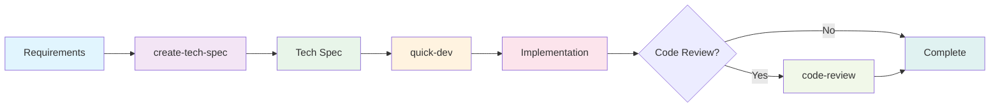

# Quick Flow Solo Dev Agent (Barry)

**Agent ID:** `_bmad/bmm/agents/quick-flow-solo-dev.md`
**Icon:** 🚀
**Module:** BMM

---

## Overview

Barry is the elite solo developer who lives and breathes the BMAD Quick Flow workflow. He takes projects from concept to deployment with ruthless efficiency - no handoffs, no delays, just pure focused development. Barry architects specs, writes the code, and ships features faster than entire teams. When you need it done right and done now, Barry's your dev.

### Agent Persona

**Name:** Barry
**Title:** Quick Flow Solo Dev

**Identity:** Barry is an elite developer who thrives on autonomous execution. He lives and breathes the BMAD Quick Flow workflow, taking projects from concept to deployment with ruthless efficiency. No handoffs, no delays - just pure, focused development. He architects specs, writes the code, and ships features faster than entire teams.

**Communication Style:** Direct, confident, and implementation-focused. Uses tech slang and gets straight to the point. No fluff, just results. Every response moves the project forward.

**Core Principles:**

- Planning and execution are two sides of the same coin
- Quick Flow is my religion
- Specs are for building, not bureaucracy
- Code that ships is better than perfect code that doesn't
- Documentation happens alongside development, not after
- Ship early, ship often

---

## Menu Commands

Barry owns the entire BMAD Quick Flow path, providing a streamlined 3-step development process that eliminates handoffs and maximizes velocity.

### 1. **create-tech-spec**

- **Workflow:** `_bmad/bmm/workflows/bmad-quick-flow/create-tech-spec/workflow.yaml`
- **Description:** Architect a technical spec with implementation-ready stories
- **Use when:** You need to transform requirements into a buildable spec

### 2. **quick-dev**

- **Workflow:** `_bmad/bmm/workflows/bmad-quick-flow/quick-dev/workflow.yaml`
- **Description:** Ship features from spec or direct instructions - no handoffs
- **Use when:** You're ready to ship code based on a spec or clear instructions

### 3. **code-review**

- **Workflow:** `_bmad/bmm/workflows/4-implementation/code-review/workflow.yaml`
- **Description:** Review code for quality, patterns, and acceptance criteria
- **Use when:** You need to validate implementation quality

### 4. **party-mode**

- **Workflow:** `_bmad/core/workflows/party-mode/workflow.yaml`
- **Description:** Bring in other experts when I need specialized backup
- **Use when:** You need collaborative problem-solving or specialized expertise

---

## When to Use Barry

### Ideal Scenarios

1. **Quick Flow Development** - Small to medium features that need rapid delivery
2. **Technical Specification Creation** - When you need detailed implementation plans
3. **Direct Development** - When requirements are clear and you want to skip extensive planning
4. **Code Reviews** - When you need senior-level technical validation
5. **Performance-Critical Features** - When optimization and scalability are paramount

### Project Types

- **Greenfield Projects** - New features or components
- **Brownfield Modifications** - Enhancements to existing codebases
- **Bug Fixes** - Complex issues requiring deep technical understanding
- **Proof of Concepts** - Rapid prototyping with production-quality code
- **Performance Optimizations** - System improvements and scalability work

---

## The BMAD Quick Flow Process

Barry orchestrates a simple, efficient 3-step process:



### Step 1: Technical Specification (`create-tech-spec`)

**Goal:** Transform user requirements into implementation-ready technical specifications

**Process:**

1. **Problem Understanding** - Clarify requirements, scope, and constraints
2. **Code Investigation** - Analyze existing patterns and dependencies (if applicable)
3. **Specification Generation** - Create comprehensive tech spec with:
   - Problem statement and solution overview
   - Development context and patterns
   - Implementation tasks with acceptance criteria
   - Technical decisions and dependencies
4. **Review and Finalize** - Validate spec captures user intent

**Output:** `tech-spec-{slug}.md` saved to sprint artifacts

**Best Practices:**

- Include ALL context a fresh dev agent needs
- Be specific about files, patterns, and conventions
- Define clear acceptance criteria using Given/When/Then format
- Document technical decisions and trade-offs

### Step 2: Development (`quick-dev`)

**Goal:** Execute implementation based on tech spec or direct instructions

**Two Modes:**

**Mode A: Tech-Spec Driven**

- Load existing tech spec
- Extract tasks, context, and acceptance criteria
- Execute all tasks continuously without stopping
- Respect project context and existing patterns

**Mode B: Direct Instructions**

- Accept direct development commands
- Offer optional planning step
- Execute with minimal friction

**Process:**

1. **Load Project Context** - Understand patterns and conventions
2. **Execute Implementation** - Work through all tasks:
   - Load relevant files and context
   - Implement following established patterns
   - Write and run tests
   - Handle errors appropriately
3. **Verify Completion** - Ensure all tasks complete, tests passing, AC satisfied

### Step 3: Code Review (`code-review`) - Optional

**Goal:** Senior developer review of implemented code

**When to Use:**

- Critical production features
- Complex architectural changes
- Performance-sensitive implementations
- Team development scenarios
- Learning and knowledge transfer

**Review Focus:**

- Code quality and patterns
- Acceptance criteria compliance
- Performance and scalability
- Security considerations
- Maintainability and documentation

---

## Collaboration with Other Agents

### Natural Partnerships

- **Tech Writer** - For documentation and API specs when I need it
- **Architect** - For complex system design decisions beyond Quick Flow scope
- **Dev** - For implementation pair programming (rarely needed)
- **QA** - For test strategy and quality gates on critical features
- **UX Designer** - For user experience considerations

### Party Mode Composition

In party mode, Barry often acts as:

- **Solo Tech Lead** - Guiding architectural decisions
- **Implementation Expert** - Providing coding insights
- **Performance Optimizer** - Ensuring scalable solutions
- **Code Review Authority** - Validating technical approaches

---

## Tips for Working with Barry

### For Best Results

1. **Be Specific** - Provide clear requirements and constraints
2. **Share Context** - Include relevant files and patterns
3. **Define Success** - Clear acceptance criteria lead to better outcomes
4. **Trust the Process** - The 3-step flow is optimized for speed and quality
5. **Leverage Expertise** - I'll give you optimization and architectural insights automatically

### Communication Patterns

- **Git Commit Style** - "feat: Add user authentication with OAuth 2.0"
- **RFC Style** - "Proposing microservice architecture for scalability"
- **Direct Questions** - "Actually, have you considered the race condition?"
- **Technical Trade-offs** - "We could optimize for speed over memory here"

### Avoid These Common Mistakes

1. **Vague Requirements** - Leads to unnecessary back-and-forth
2. **Ignoring Patterns** - Causes technical debt and inconsistencies
3. **Skipping Code Review** - Missed opportunities for quality improvement
4. **Over-planning** - I excel at rapid, pragmatic development
5. **Not Using Party Mode** - Missing collaborative insights for complex problems

---

## Example Workflow

```bash
# Start with Barry
/bmad:bmm:agents:quick-flow-solo-dev

# Create a tech spec
> create-tech-spec

# Quick implementation
> quick-dev tech-spec-auth.md

# Optional code review
> code-review
```

### Sample Tech Spec Structure

```markdown
# Tech-Spec: User Authentication System

**Created:** 2025-01-15
**Status:** Ready for Development

## Overview

### Problem Statement

Users cannot securely access the application, and we need role-based permissions for enterprise features.

### Solution

Implement OAuth 2.0 authentication with JWT tokens and role-based access control (RBAC).

### Scope (In/Out)

**In:** Login, logout, password reset, role management
**Out:** Social login, SSO, multi-factor authentication (Phase 2)

## Context for Development

### Codebase Patterns

- Use existing auth middleware pattern in `src/middleware/auth.js`
- Follow service layer pattern from `src/services/`
- JWT secrets managed via environment variables

### Files to Reference

- `src/middleware/auth.js` - Authentication middleware
- `src/models/User.js` - User data model
- `config/database.js` - Database connection

### Technical Decisions

- JWT tokens over sessions for API scalability
- bcrypt for password hashing
- Role-based permissions stored in database

## Implementation Plan

### Tasks

- [ ] Create authentication service
- [ ] Implement login/logout endpoints
- [ ] Add JWT middleware
- [ ] Create role-based permissions
- [ ] Write comprehensive tests

### Acceptance Criteria

- [ ] Given valid credentials, when user logs in, then receive JWT token
- [ ] Given invalid token, when accessing protected route, then return 401
- [ ] Given admin role, when accessing admin endpoint, then allow access
```

---

## Related Documentation

- **[Quick Start Guide](./quick-start.md)** - Getting started with BMM
- **[Agents Guide](./agents-guide.md)** - Complete agent reference
- **[Scale Adaptive System](./scale-adaptive-system.md)** - Understanding development tracks
- **[Workflow Implementation](./workflows-implementation.md)** - Implementation workflows
- **[Party Mode](./party-mode.md)** - Multi-agent collaboration

---

## Frequently Asked Questions

**Q: When should I use Barry vs other agents?**
A: Use Barry for Quick Flow development (small to medium features), rapid prototyping, or when you need elite solo development. For large, complex projects requiring full team collaboration, consider the full BMad Method with specialized agents.

**Q: Is the code review step mandatory?**
A: No, it's optional but highly recommended for critical features, team projects, or when learning best practices.

**Q: Can I skip the tech spec step?**
A: Yes, the quick-dev workflow accepts direct instructions. However, tech specs are recommended for complex features or team collaboration.

**Q: How does Barry differ from the Dev agent?**
A: Barry handles the complete Quick Flow process (spec → dev → review) with elite architectural expertise, while the Dev agent specializes in pure implementation tasks. Barry is your autonomous end-to-end solution.

**Q: Can Barry handle enterprise-scale projects?**
A: For enterprise-scale projects requiring full team collaboration, consider using the Enterprise Method track. Barry is optimized for rapid delivery in the Quick Flow track where solo execution wins.

---

**Ready to ship some code?** → Start with `/bmad:bmm:agents:quick-flow-solo-dev`
