# BMad Quick Spec Flow

**Perfect for:** Bug fixes, small features, rapid prototyping, and quick enhancements

**Time to implementation:** Minutes, not hours

---

## What is Quick Spec Flow?

Quick Spec Flow is a **streamlined alternative** to the full BMad Method for Quick Flow track projects. Instead of going through Product Brief → PRD → Architecture, you go **straight to a context-aware technical specification** and start coding.

### When to Use Quick Spec Flow

✅ **Use Quick Flow track when:**

- Single bug fix or small enhancement
- Small feature with clear scope (typically 1-15 stories)
- Rapid prototyping or experimentation
- Adding to existing brownfield codebase
- You know exactly what you want to build

❌ **Use BMad Method or Enterprise tracks when:**

- Building new products or major features
- Need stakeholder alignment
- Complex multi-team coordination
- Requires extensive planning and architecture

💡 **Not sure?** Run `workflow-init` to get a recommendation based on your project's needs!

---

## Quick Spec Flow Overview

```mermaid
flowchart TD
    START[Step 1: Run Tech-Spec Workflow]
    DETECT[Detects project stack<br/>package.json, requirements.txt, etc.]
    ANALYZE[Analyzes brownfield codebase<br/>if exists]
    TEST[Detects test frameworks<br/>and conventions]
    CONFIRM[Confirms conventions<br/>with you]
    GENERATE[Generates context-rich<br/>tech-spec]
    STORIES[Creates ready-to-implement<br/>stories]

    OPTIONAL[Step 2: Optional<br/>Generate Story Context<br/>SM Agent<br/>For complex scenarios only]

    IMPL[Step 3: Implement<br/>DEV Agent<br/>Code, test, commit]

    DONE[DONE! 🚀]

    START --> DETECT
    DETECT --> ANALYZE
    ANALYZE --> TEST
    TEST --> CONFIRM
    CONFIRM --> GENERATE
    GENERATE --> STORIES
    STORIES --> OPTIONAL
    OPTIONAL -.->|Optional| IMPL
    STORIES --> IMPL
    IMPL --> DONE

    style START fill:#bfb,stroke:#333,stroke-width:2px
    style OPTIONAL fill:#ffb,stroke:#333,stroke-width:2px,stroke-dasharray: 5 5
    style IMPL fill:#bbf,stroke:#333,stroke-width:2px
    style DONE fill:#f9f,stroke:#333,stroke-width:3px
```



---

## Single Atomic Change

**Best for:** Bug fixes, single file changes, isolated improvements

### What You Get

1. **tech-spec.md** - Comprehensive technical specification with:
   - Problem statement and solution
   - Detected framework versions and dependencies
   - Brownfield code patterns (if applicable)
   - Existing test patterns to follow
   - Specific file paths to modify
   - Complete implementation guidance

2. **story-[slug].md** - Single user story ready for development

### Quick Spec Flow Commands

```bash
# Start Quick Spec Flow (no workflow-init needed!)
# Load PM agent and run tech-spec

# When complete, implement directly:
# Load DEV agent and run dev-story
```

### What Makes It Quick

- ✅ No Product Brief needed
- ✅ No PRD needed
- ✅ No Architecture doc needed
- ✅ Auto-detects your stack
- ✅ Auto-analyzes brownfield code
- ✅ Auto-validates quality
- ✅ Story context optional (tech-spec is comprehensive!)

### Example Single Change Scenarios

- "Fix the login validation bug"
- "Add email field to user registration form"
- "Update API endpoint to return additional field"
- "Improve error handling in payment processing"

---

## Coherent Small Feature

**Best for:** Small features with 2-3 related user stories

### What You Get

1. **tech-spec.md** - Same comprehensive spec as single change projects
2. **epics.md** - Epic organization with story breakdown
3. **story-[epic-slug]-1.md** - First story
4. **story-[epic-slug]-2.md** - Second story
5. **story-[epic-slug]-3.md** - Third story (if needed)

### Quick Spec Flow Commands

```bash
# Start Quick Spec Flow
# Load PM agent and run tech-spec

# Optional: Organize stories as a sprint
# Load SM agent and run sprint-planning

# Implement story-by-story:
# Load DEV agent and run dev-story for each story
```

### Story Sequencing

Stories are **automatically validated** to ensure proper sequence:

- ✅ No forward dependencies (Story 2 can't depend on Story 3)
- ✅ Clear dependency documentation
- ✅ Infrastructure → Features → Polish order
- ✅ Backend → Frontend flow

### Example Small Feature Scenarios

- "Add OAuth social login (Google, GitHub, Twitter)"
- "Build user profile page with avatar upload"
- "Implement basic search with filters"
- "Add dark mode toggle to application"

---

## Smart Context Discovery

Quick Spec Flow automatically discovers and uses:

### 1. Existing Documentation

- Product briefs (if they exist)
- Research documents
- `document-project` output (brownfield codebase map)

### 2. Project Stack

- **Node.js:** package.json → frameworks, dependencies, scripts, test framework
- **Python:** requirements.txt, pyproject.toml → packages, tools
- **Ruby:** Gemfile → gems and versions
- **Java:** pom.xml, build.gradle → Maven/Gradle dependencies
- **Go:** go.mod → modules
- **Rust:** Cargo.toml → crates
- **PHP:** composer.json → packages

### 3. Brownfield Code Patterns

- Directory structure and organization
- Existing code patterns (class-based, functional, MVC)
- Naming conventions (camelCase, snake_case, PascalCase)
- Test frameworks and patterns
- Code style (semicolons, quotes, indentation)
- Linter/formatter configs
- Error handling patterns
- Logging conventions
- Documentation style

### 4. Convention Confirmation

**IMPORTANT:** Quick Spec Flow detects your conventions and **asks for confirmation**:

```
I've detected these conventions in your codebase:

Code Style:
- ESLint with Airbnb config
- Prettier with single quotes, 2-space indent
- No semicolons

Test Patterns:
- Jest test framework
- .test.js file naming
- expect() assertion style

Should I follow these existing conventions? (yes/no)
```

**You decide:** Conform to existing patterns or establish new standards!

---

## Modern Best Practices via WebSearch

Quick Spec Flow stays current by using WebSearch when appropriate:

### For Greenfield Projects

- Searches for latest framework versions
- Recommends official starter templates
- Suggests modern best practices

### For Outdated Dependencies

- Detects if your dependencies are >2 years old
- Searches for migration guides
- Notes upgrade complexity

### Starter Template Recommendations

For greenfield projects, Quick Spec Flow recommends:

**React:**

- Vite (modern, fast)
- Next.js (full-stack)

**Python:**

- cookiecutter templates
- FastAPI starter

**Node.js:**

- NestJS CLI
- express-generator

**Benefits:**

- ✅ Modern best practices baked in
- ✅ Proper project structure
- ✅ Build tooling configured
- ✅ Testing framework set up
- ✅ Faster time to first feature

---

## UX/UI Considerations

For user-facing changes, Quick Spec Flow captures:

- UI components affected (create vs modify)
- UX flow changes (current vs new)
- Responsive design needs (mobile, tablet, desktop)
- Accessibility requirements:
  - Keyboard navigation
  - Screen reader compatibility
  - ARIA labels
  - Color contrast standards
- User feedback patterns:
  - Loading states
  - Error messages
  - Success confirmations
  - Progress indicators

---

## Auto-Validation and Quality Assurance

Quick Spec Flow **automatically validates** everything:

### Tech-Spec Validation (Always Runs)

Checks:

- ✅ Context gathering completeness
- ✅ Definitiveness (no "use X or Y" statements)
- ✅ Brownfield integration quality
- ✅ Stack alignment
- ✅ Implementation readiness

Generates scores:

```
✅ Validation Passed!
- Context Gathering: Comprehensive
- Definitiveness: All definitive
- Brownfield Integration: Excellent
- Stack Alignment: Perfect
- Implementation Readiness: ✅ Ready
```

### Story Validation (Multi-Story Features)

Checks:

- ✅ Story sequence (no forward dependencies!)
- ✅ Acceptance criteria quality (specific, testable)
- ✅ Completeness (all tech spec tasks covered)
- ✅ Clear dependency documentation

**Auto-fixes issues if found!**

---

## Complete User Journey

### Scenario 1: Bug Fix (Single Change)

**Goal:** Fix login validation bug

**Steps:**

1. **Start:** Load PM agent, say "I want to fix the login validation bug"
2. **PM runs tech-spec workflow:**
   - Asks: "What problem are you solving?"
   - You explain the validation issue
   - Detects your Node.js stack (Express 4.18.2, Jest for testing)
   - Analyzes existing UserService code patterns
   - Asks: "Should I follow your existing conventions?" → You say yes
   - Generates tech-spec.md with specific file paths and patterns
   - Creates story-login-fix.md
3. **Implement:** Load DEV agent, run `dev-story`
   - DEV reads tech-spec (has all context!)
   - Implements fix following existing patterns
   - Runs tests (following existing Jest patterns)
   - Done!

**Total time:** 15-30 minutes (mostly implementation)

---

### Scenario 2: Small Feature (Multi-Story)

**Goal:** Add OAuth social login (Google, GitHub)

**Steps:**

1. **Start:** Load PM agent, say "I want to add OAuth social login"
2. **PM runs tech-spec workflow:**
   - Asks about the feature scope
   - You specify: Google and GitHub OAuth
   - Detects your stack (Next.js 13.4, NextAuth.js already installed!)
   - Analyzes existing auth patterns
   - Confirms conventions with you
   - Generates:
     - tech-spec.md (comprehensive implementation guide)
     - epics.md (OAuth Integration epic)
     - story-oauth-1.md (Backend OAuth setup)
     - story-oauth-2.md (Frontend login buttons)
3. **Optional Sprint Planning:** Load SM agent, run `sprint-planning`
4. **Implement Story 1:**
   - Load DEV agent, run `dev-story` for story 1
   - DEV implements backend OAuth
5. **Implement Story 2:**
   - DEV agent, run `dev-story` for story 2
   - DEV implements frontend
   - Done!

**Total time:** 1-3 hours (mostly implementation)

---

## Integration with Phase 4 Workflows

Quick Spec Flow works seamlessly with all Phase 4 implementation workflows:

### create-story (SM Agent)

- ✅ Can work with tech-spec.md instead of PRD
- ✅ Uses epics.md from tech-spec workflow
- ✅ Creates additional stories if needed

### sprint-planning (SM Agent)

- ✅ Works with epics.md from tech-spec
- ✅ Organizes multi-story features for coordinated implementation
- ✅ Tracks progress through sprint-status.yaml

### dev-story (DEV Agent)

- ✅ Reads stories generated by tech-spec
- ✅ Uses tech-spec.md as comprehensive context
- ✅ Implements following detected conventions

---

## Comparison: Quick Spec vs Full BMM

| Aspect                | Quick Flow Track             | BMad Method/Enterprise Tracks      |
| --------------------- | ---------------------------- | ---------------------------------- |
| **Setup**             | None (standalone)            | workflow-init recommended          |
| **Planning Docs**     | tech-spec.md only            | Product Brief → PRD → Architecture |
| **Time to Code**      | Minutes                      | Hours to days                      |
| **Best For**          | Bug fixes, small features    | New products, major features       |
| **Context Discovery** | Automatic                    | Manual + guided                    |
| **Story Context**     | Optional (tech-spec is rich) | Required (generated from PRD)      |
| **Validation**        | Auto-validates everything    | Manual validation steps            |
| **Brownfield**        | Auto-analyzes and conforms   | Manual documentation required      |
| **Conventions**       | Auto-detects and confirms    | Document in PRD/Architecture       |

---

## When to Graduate from Quick Flow to BMad Method

Start with Quick Flow, but switch to BMad Method when:

- ❌ Project grows beyond initial scope
- ❌ Multiple teams need coordination
- ❌ Stakeholders need formal documentation
- ❌ Product vision is unclear
- ❌ Architectural decisions need deep analysis
- ❌ Compliance/regulatory requirements exist

💡 **Tip:** You can always run `workflow-init` later to transition from Quick Flow to BMad Method!

---

## Quick Spec Flow - Key Benefits

### 🚀 **Speed**

- No Product Brief
- No PRD
- No Architecture doc
- Straight to implementation

### 🧠 **Intelligence**

- Auto-detects stack
- Auto-analyzes brownfield
- Auto-validates quality
- WebSearch for current info

### 📐 **Respect for Existing Code**

- Detects conventions
- Asks for confirmation
- Follows patterns
- Adapts vs. changes

### ✅ **Quality**

- Auto-validation
- Definitive decisions (no "or" statements)
- Comprehensive context
- Clear acceptance criteria

### 🎯 **Focus**

- Single atomic changes
- Coherent small features
- No scope creep
- Fast iteration

---

## Getting Started

### Prerequisites

- BMad Method installed (`npx bmad-method install`)
- Project directory with code (or empty for greenfield)

### Quick Start Commands

```bash
# For a quick bug fix or small change:
# 1. Load PM agent
# 2. Say: "I want to [describe your change]"
# 3. PM will ask if you want to run tech-spec
# 4. Answer questions about your change
# 5. Get tech-spec + story
# 6. Load DEV agent and implement!

# For a small feature with multiple stories:
# Same as above, but get epic + 2-3 stories
# Optionally use SM sprint-planning to organize
```

### No workflow-init Required!

Quick Spec Flow is **fully standalone**:

- Detects if it's a single change or multi-story feature
- Asks for greenfield vs brownfield
- Works without status file tracking
- Perfect for rapid prototyping

---

## FAQ

### Q: Can I use Quick Spec Flow on an existing project?

**A:** Yes! It's perfect for brownfield projects. It will analyze your existing code, detect patterns, and ask if you want to follow them.

### Q: What if I don't have a package.json or requirements.txt?

**A:** Quick Spec Flow will work in greenfield mode, recommend starter templates, and use WebSearch for modern best practices.

### Q: Do I need to run workflow-init first?

**A:** No! Quick Spec Flow is standalone. But if you want guidance on which flow to use, workflow-init can help.

### Q: Can I use this for frontend changes?

**A:** Absolutely! Quick Spec Flow captures UX/UI considerations, component changes, and accessibility requirements.

### Q: What if my Quick Flow project grows?

**A:** No problem! You can always transition to BMad Method by running workflow-init and create-prd. Your tech-spec becomes input for the PRD.

### Q: Can I skip validation?

**A:** No, validation always runs automatically. But it's fast and catches issues early!

### Q: Will it work with my team's code style?

**A:** Yes! It detects your conventions and asks for confirmation. You control whether to follow existing patterns or establish new ones.

---

## Tips and Best Practices

### 1. **Be Specific in Discovery**

When describing your change, provide specifics:

- ✅ "Fix email validation in UserService to allow plus-addressing"
- ❌ "Fix validation bug"

### 2. **Trust the Convention Detection**

If it detects your patterns correctly, say yes! It's faster than establishing new conventions.

### 3. **Use WebSearch Recommendations for Greenfield**

Starter templates save hours of setup time. Let Quick Spec Flow find the best ones.

### 4. **Review the Auto-Validation**

When validation runs, read the scores. They tell you if your spec is production-ready.

### 5. **Keep Single Changes Truly Atomic**

If your "single change" needs 3+ files, it might be a multi-story feature. Let the workflow guide you.

### 6. **Validate Story Sequence for Multi-Story Features**

When you get multiple stories, check the dependency validation output. Proper sequence matters!

---

## Real-World Examples

### Example 1: Adding Logging (Single Change)

**Input:** "Add structured logging to payment processing"

**Tech-Spec Output:**

- Detected: winston 3.8.2 already in package.json
- Analyzed: Existing services use winston with JSON format
- Confirmed: Follow existing logging patterns
- Generated: Specific file paths, log levels, format example
- Story: Ready to implement in 1-2 hours

**Result:** Consistent logging added, following team patterns, no research needed.

---

### Example 2: Search Feature (Multi-Story)

**Input:** "Add search to product catalog with filters"

**Tech-Spec Output:**

- Detected: React 18.2.0, MUI component library, Express backend
- Analyzed: Existing ProductList component patterns
- Confirmed: Follow existing API and component structure
- Generated:
  - Epic: Product Search Functionality
  - Story 1: Backend search API with filters
  - Story 2: Frontend search UI component
- Auto-validated: Story 1 → Story 2 sequence correct

**Result:** Search feature implemented in 4-6 hours with proper architecture.

---

## Summary

Quick Spec Flow is your **fast path from idea to implementation** for:

- 🐛 Bug fixes
- ✨ Small features
- 🚀 Rapid prototyping
- 🔧 Quick enhancements

**Key Features:**

- Auto-detects your stack
- Auto-analyzes brownfield code
- Auto-validates quality
- Respects existing conventions
- Uses WebSearch for modern practices
- Generates comprehensive tech-specs
- Creates implementation-ready stories

**Time to code:** Minutes, not hours.

**Ready to try it?** Load the PM agent and say what you want to build! 🚀

---

## Next Steps

- **Try it now:** Load PM agent and describe a small change
- **Learn more:** See the [BMM Workflow Guides](./index.md#-workflow-guides) for comprehensive workflow documentation
- **Need help deciding?** Run `workflow-init` to get a recommendation
- **Have questions?** Join us on Discord: <https://discord.gg/gk8jAdXWmj>

---

_Quick Spec Flow - Because not every change needs a Product Brief._
