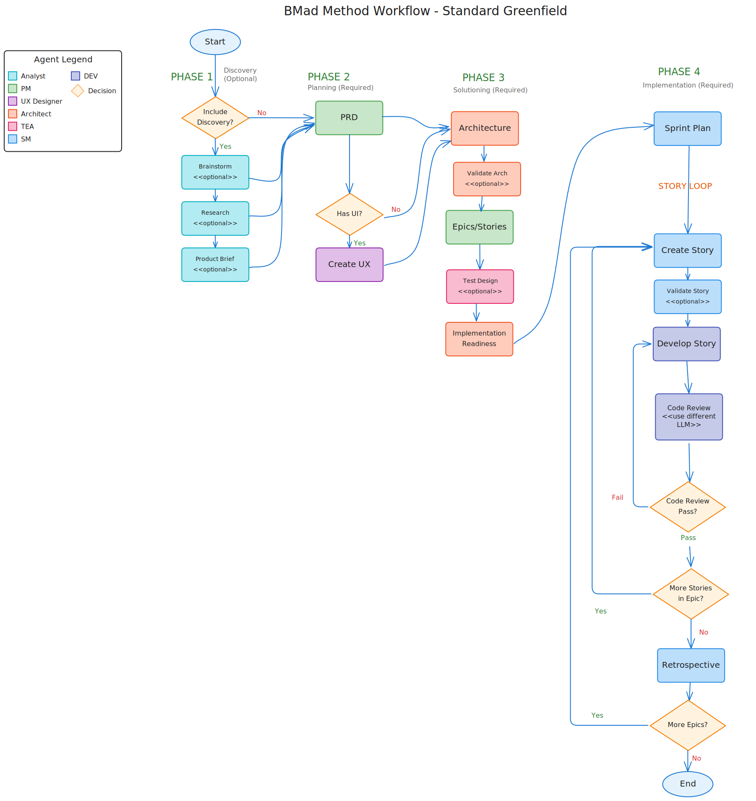
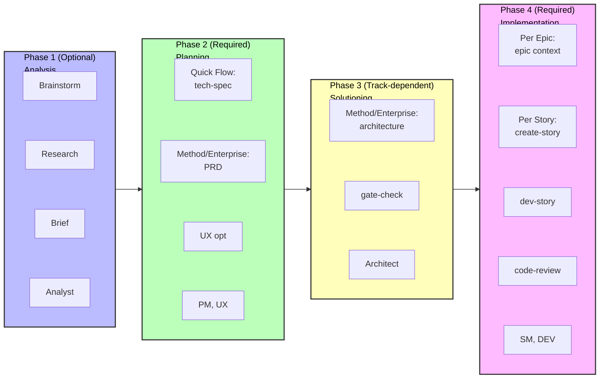

# BMad Method V6 Quick Start Guide

Get started with BMad Method v6 for your new greenfield project. This guide walks you through building software from scratch using AI-powered workflows.

## TL;DR - The Quick Path

1. **Install**: `npx bmad-method@alpha install`
2. **Initialize**: Load Analyst agent → Run "workflow-init"
3. **Plan**: Load PM agent to create a PRD
4. **Plan UX**: Load UX Expert to create a UX-Design if your application will have a UX/UI element
5. **Architect**: Load Architect agent → Run "create-architecture"
6. **Epic Plan**: The PM steps back in to help run the create-epics-and-stories
7. **Build**: Load SM agent → Run workflows for each story → Load DEV agent → Implement
8. **Always use fresh chats** for each workflow to avoid context issues

## What is BMad Method?

BMad Method (BMM) helps you build software through guided workflows with specialized AI agents. The process follows four phases:

1. **Phase 1: Analysis** (Optional) - Brainstorming, Research, Product Brief
2. **Phase 2: Planning** (Required) - Create your requirements (tech-spec or PRD)
3. **Phase 3: Solutioning** (Track-dependent) - Design the architecture for BMad Method and Enterprise tracks
4. **Phase 4: Implementation** (Required) - Build your software Epic by Epic, Story by Story

### Complete Workflow Visualization



_Complete visual flowchart showing all phases, workflows, agents (color-coded), and decision points for the BMad Method standard greenfield track. Each box is color-coded by the agent responsible for that workflow._

## Installation

```bash
# Install v6 Alpha to your project
npx bmad-method@alpha install
```

The interactive installer will guide you through setup and create a `_bmad/` folder with all agents and workflows.

---

## Getting Started

### Step 1: Initialize Your Workflow

1. **Load the Analyst agent** in your IDE - See your IDE-specific instructions in [docs/ide-info](https://github.com/bmad-code-org/BMAD-METHOD/tree/main/docs/ide-info) for how to activate agents:
   - [Claude Code](https://github.com/bmad-code-org/BMAD-METHOD/blob/main/docs/ide-info/claude-code.md)
   - [VS Code/Cursor/Windsurf](https://github.com/bmad-code-org/BMAD-METHOD/tree/main/docs/ide-info) - Check your IDE folder
   - Other IDEs also supported
2. **Wait for the agent's menu** to appear
3. **Tell the agent**: "Run workflow-init" or type "\*workflow-init" or select the menu item number

#### What happens during workflow-init?

Workflows are interactive processes in V6 that replaced tasks and templates from prior versions. There are many types of workflows, and you can even create your own with the BMad Builder module. For the BMad Method, you'll be interacting with expert-designed workflows crafted to work with you to get the best out of both you and the LLM.

During workflow-init, you'll describe:

- Your project and its goals
- Whether there's an existing codebase or this is a new project
- The general size and complexity (you can adjust this later)

#### Planning Tracks

Based on your description, the workflow will suggest a track and let you choose from:

**Three Planning Tracks:**

- **Quick Flow** - Fast implementation (tech-spec only) - bug fixes, simple features, clear scope (typically 1-15 stories)
- **BMad Method** - Full planning (PRD + Architecture + UX) - products, platforms, complex features (typically 10-50+ stories)
- **Enterprise Method** - Extended planning (BMad Method + Security/DevOps/Test) - enterprise requirements, compliance, multi-tenant (typically 30+ stories)

**Note**: Story counts are guidance, not definitions. Tracks are chosen based on planning needs, not story math.

#### What gets created?

Once you confirm your track, the `bmm-workflow-status.yaml` file will be created in your project's docs folder (assuming default install location). This file tracks your progress through all phases.

**Important notes:**

- Every track has different paths through the phases
- Story counts can still change based on overall complexity as you work
- For this guide, we'll assume a BMad Method track project
- This workflow will guide you through Phase 1 (optional), Phase 2 (required), and Phase 3 (required for BMad Method and Enterprise tracks)

### Step 2: Work Through Phases 1-3

After workflow-init completes, you'll work through the planning phases. **Important: Use fresh chats for each workflow to avoid context limitations.**

#### Checking Your Status

If you're unsure what to do next:

1. Load any agent in a new chat
2. Ask for "workflow-status"
3. The agent will tell you the next recommended or required workflow

**Example response:**

```
Phase 1 (Analysis) is entirely optional. All workflows are optional or recommended:
  - brainstorm-project - optional
  - research - optional
  - product-brief - RECOMMENDED (but not required)

The next TRULY REQUIRED step is:
  - PRD (Product Requirements Document) in Phase 2 - Planning
  - Agent: pm
  - Command: prd
```

#### How to Run Workflows in Phases 1-3

When an agent tells you to run a workflow (like `prd`):

1. **Start a new chat** with the specified agent (e.g., PM) - See [docs/ide-info](https://github.com/bmad-code-org/BMAD-METHOD/tree/main/docs/ide-info) for your IDE's specific instructions
2. **Wait for the menu** to appear
3. **Tell the agent** to run it using any of these formats:
   - Type the shorthand: `*prd`
   - Say it naturally: "Let's create a new PRD"
   - Select the menu number for "create-prd"

The agents in V6 are very good with fuzzy menu matching!

#### Quick Reference: Agent → Document Mapping

For v4 users or those who prefer to skip workflow-status guidance:

- **Analyst** → Brainstorming, Product Brief
- **PM** → PRD (BMad Method/Enterprise tracks) OR tech-spec (Quick Flow track)
- **UX-Designer** → UX Design Document (if UI part of the project)
- **Architect** → Architecture (BMad Method/Enterprise tracks)

#### Phase 2: Planning - Creating the PRD

**For BMad Method and Enterprise tracks:**

1. Load the **PM agent** in a new chat
2. Tell it to run the PRD workflow
3. Once complete, you'll have:
   - **PRD.md** - Your Product Requirements Document

**For Quick Flow track:**

- Use **tech-spec** instead of PRD (no architecture needed)

#### Phase 2 (Optional): UX Design

If your project has a user interface:

1. Load the **UX-Designer agent** in a new chat
2. Tell it to run the UX design workflow
3. After completion, you'll have your UX specification document

#### Phase 3: Architecture

**For BMad Method and Enterprise tracks:**

1. Load the **Architect agent** in a new chat
2. Tell it to run the create-architecture workflow
3. After completion, you'll have your architecture document with technical decisions

#### Phase 3: Create Epics and Stories (REQUIRED after Architecture)

**V6 Improvement:** Epics and stories are now created AFTER architecture for better quality!

1. Load the **PM agent** in a new chat
2. Tell it to run "create-epics-and-stories"
3. This breaks down your PRD's FRs/NFRs into implementable epics and stories
4. The workflow uses both PRD and Architecture to create technically-informed stories

**Why after architecture?** Architecture decisions (database, API patterns, tech stack) directly affect how stories should be broken down and sequenced.

#### Phase 3: Implementation Readiness Check (Highly Recommended)

Once epics and stories are created:

1. Load the **Architect agent** in a new chat
2. Tell it to run "implementation-readiness"
3. This validates cohesion across all your planning documents (PRD, UX, Architecture, Epics)
4. This was called the "PO Master Checklist" in v4

**Why run this?** It ensures all your planning assets align properly before you start building.

#### Context Management Tips

- **Use 200k+ context models** for best results (Claude Sonnet 4.5, GPT-4, etc.)
- **Fresh chat for each workflow** - Brainstorming, Briefs, Research, and PRD generation are all context-intensive
- **No document sharding needed** - Unlike v4, you don't need to split documents
- **Web Bundles coming soon** - Will help save LLM tokens for users with limited plans

### Step 3: Start Building (Phase 4 - Implementation)

Once planning and architecture are complete, you'll move to Phase 4. **Important: Each workflow below should be run in a fresh chat to avoid context limitations and hallucinations.**

#### 3.1 Initialize Sprint Planning

1. **Start a new chat** with the **SM (Scrum Master) agent**
2. Wait for the menu to appear
3. Tell the agent: "Run sprint-planning"
4. This creates your `sprint-status.yaml` file that tracks all epics and stories

#### 3.2 Create Your First Story

1. **Start a new chat** with the **SM agent**
2. Wait for the menu
3. Tell the agent: "Run create-story"
4. This creates the story file from the epic

#### 3.3 Implement the Story

1. **Start a new chat** with the **DEV agent**
2. Wait for the menu
3. Tell the agent: "Run dev-story"
4. The DEV agent will implement the story and update the sprint status

#### 3.4 Review the Code (Optional but Recommended)

1. **Start a new chat** with the **DEV agent**
2. Wait for the menu
3. Tell the agent: "Run code-review"
4. The DEV agent performs quality validation (this was called QA in v4)

### Step 4: Keep Going

For each subsequent story, repeat the cycle using **fresh chats** for each workflow:

1. **New chat** → SM agent → "Run create-story"
2. **New chat** → DEV agent → "Run dev-story"
3. **New chat** → DEV agent → "Run code-review" (optional but recommended)

After completing all stories in an epic:

1. **Start a new chat** with the **SM agent**
2. Tell the agent: "Run retrospective"

**Why fresh chats?** Context-intensive workflows can cause hallucinations if you keep issuing commands in the same chat. Starting fresh ensures the agent has maximum context capacity for each workflow.

---

## Understanding the Agents

Each agent is a specialized AI persona:

- **Analyst** - Initializes workflows and tracks progress
- **PM** - Creates requirements and specifications
- **UX-Designer** - If your project has a front end - this designer will help produce artifacts, come up with mock updates, and design a great look and feel with you giving it guidance.
- **Architect** - Designs system architecture
- **SM (Scrum Master)** - Manages sprints and creates stories
- **DEV** - Implements code and reviews work

## How Workflows Work

1. **Load an agent** - Open the agent file in your IDE to activate it
2. **Wait for the menu** - The agent will present its available workflows
3. **Tell the agent what to run** - Say "Run [workflow-name]"
4. **Follow the prompts** - The agent guides you through each step

The agent creates documents, asks questions, and helps you make decisions throughout the process.

## Project Tracking Files

BMad creates two files to track your progress:

**1. bmm-workflow-status.yaml**

- Shows which phase you're in and what's next
- Created by workflow-init
- Updated automatically as you progress through phases

**2. sprint-status.yaml** (Phase 4 only)

- Tracks all your epics and stories during implementation
- Critical for SM and DEV agents to know what to work on next
- Created by sprint-planning workflow
- Updated automatically as stories progress

**You don't need to edit these manually** - agents update them as you work.

---

## The Complete Flow Visualized



## Common Questions

**Q: Do I always need architecture?**
A: Only for BMad Method and Enterprise tracks. Quick Flow projects skip straight from tech-spec to implementation.

**Q: Can I change my plan later?**
A: Yes! The SM agent has a "correct-course" workflow for handling scope changes.

**Q: What if I want to brainstorm first?**
A: Load the Analyst agent and tell it to "Run brainstorm-project" before running workflow-init.

**Q: Why do I need fresh chats for each workflow?**
A: Context-intensive workflows can cause hallucinations if run in sequence. Fresh chats ensure maximum context capacity.

**Q: Can I skip workflow-init and workflow-status?**
A: Yes, once you learn the flow. Use the Quick Reference in Step 2 to go directly to the workflows you need.

## Getting Help

- **During workflows**: Agents guide you with questions and explanations
- **Community**: [Discord](https://discord.gg/gk8jAdXWmj) - #general-dev, #bugs-issues
- **Complete guide**: [BMM Workflow Documentation](./index.md#-workflow-guides)
- **YouTube tutorials**: [BMad Code Channel](https://www.youtube.com/@BMadCode)

---

## Key Takeaways

✅ **Always use fresh chats** - Load agents in new chats for each workflow to avoid context issues
✅ **Let workflow-status guide you** - Load any agent and ask for status when unsure what's next
✅ **Track matters** - Quick Flow uses tech-spec, BMad Method/Enterprise need PRD and architecture
✅ **Tracking is automatic** - The status files update themselves, no manual editing needed
✅ **Agents are flexible** - Use menu numbers, shortcuts (\*prd), or natural language

**Ready to start building?** Install BMad, load the Analyst, run workflow-init, and let the agents guide you!
