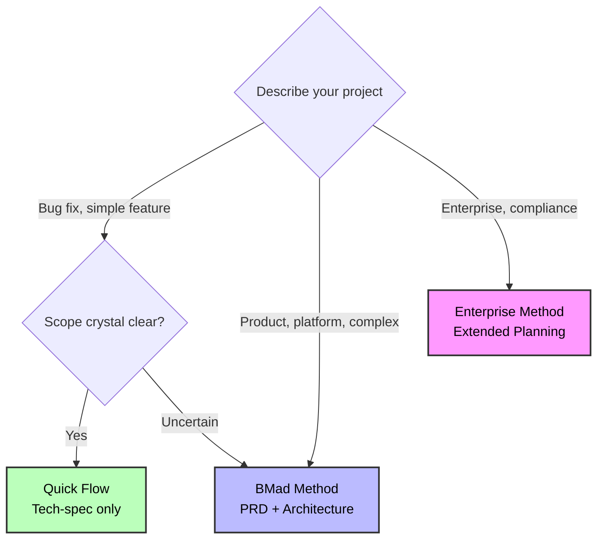
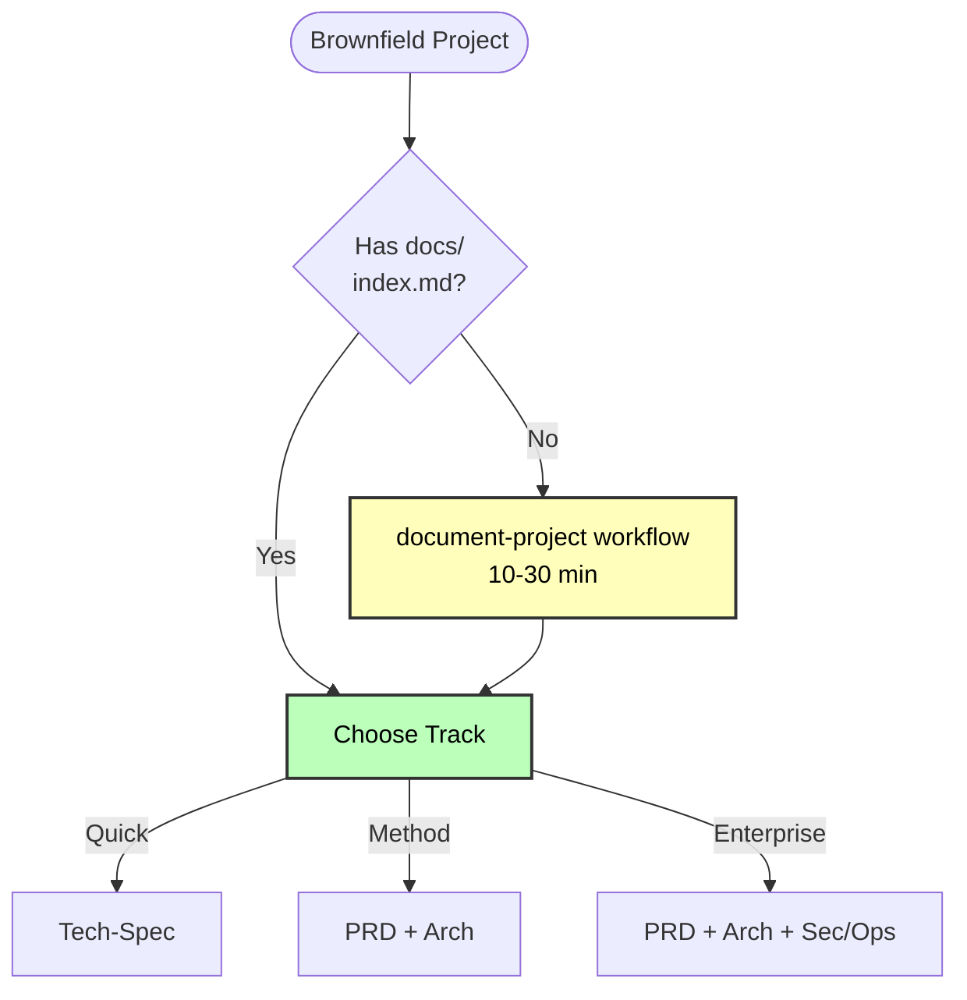

# BMad Method Scale Adaptive System

**Automatically adapts workflows to project complexity - from quick fixes to enterprise systems**

---

## Overview

The **Scale Adaptive System** intelligently routes projects to the right planning methodology based on complexity, not arbitrary story counts.

### The Problem

Traditional methodologies apply the same process to every project:

- Bug fix requires full design docs
- Enterprise system built with minimal planning
- One-size-fits-none approach

### The Solution

BMad Method adapts to three distinct planning tracks:

- **Quick Flow**: Tech-spec only, implement immediately
- **BMad Method**: PRD + Architecture, structured approach
- **Enterprise Method**: Full planning with security/devops/test

**Result**: Right planning depth for every project.

---

## Quick Reference

### Three Tracks at a Glance

| Track                 | Planning Depth        | Best For                                   |
| --------------------- | --------------------- | ------------------------------------------ |
| **Quick Flow**        | Tech-spec only        | Simple features, bug fixes, clear scope    |
| **BMad Method**       | PRD + Arch + UX       | Products, platforms, complex features      |
| **Enterprise Method** | Method + Test/Sec/Ops | Enterprise needs, compliance, multi-tenant |

### Decision Tree



### Quick Keywords

- **Quick Flow**: fix, bug, simple, add, clear scope
- **BMad Method**: product, platform, dashboard, complex, multiple features
- **Enterprise Method**: enterprise, multi-tenant, compliance, security, audit

---

## How Track Selection Works

When you run `workflow-init`, it guides you through an educational choice:

### 1. Description Analysis

Analyzes your project description for complexity indicators and suggests an appropriate track.

### 2. Educational Presentation

Shows all three tracks with:

- Time investment
- Planning approach
- Benefits and trade-offs
- AI agent support level
- Concrete examples

### 3. Honest Recommendation

Provides tailored recommendation based on:

- Complexity keywords
- Greenfield vs brownfield
- User's description

### 4. User Choice

You choose the track that fits your situation. The system guides but never forces.

**Example:**

```
workflow-init: "Based on 'Add user dashboard with analytics', I recommend BMad Method.
               This involves multiple features and system design. The PRD + Architecture
               gives AI agents complete context for better code generation."

You: "Actually, this is simpler than it sounds. Quick Flow."

workflow-init: "Got it! Using Quick Flow with tech-spec."
```

---

## The Three Tracks

### Track 1: Quick Flow

**Definition**: Fast implementation with tech-spec planning.

**Time**: Hours to 1 day of planning

**Planning Docs**:

- Tech-spec.md (implementation-focused)
- Story files (1-15 typically, auto-detects epic structure)

**Workflow Path**:

```
(Brownfield: document-project first if needed)
↓
Tech-Spec → Implement
```

**Use For**:

- Bug fixes
- Simple features
- Enhancements with clear scope
- Quick additions

**Story Count**: Typically 1-15 stories (guidance, not rule)

**Example**: "Fix authentication token expiration bug"

**AI Agent Support**: Basic - minimal context provided

**Trade-off**: Less planning = higher rework risk if complexity emerges

---

### Track 2: BMad Method (RECOMMENDED)

**Definition**: Full product + system design planning.

**Time**: 1-3 days of planning

**Planning Docs**:

- PRD.md (functional and non-functional requirements)
- Architecture.md (system design)
- UX Design (if UI components)
- Epics and Stories (created after architecture)

**Workflow Path**:

```
(Brownfield: document-project first if needed)
↓
(Optional: Analysis phase - brainstorm, research, product brief)
↓
PRD → (Optional UX) → Architecture → Create Epics and Stories → Implementation Readiness Check → Implement
```

**Complete Workflow Visualization**:


_Detailed flowchart showing all phases, workflows, agents (color-coded), and decision points for the BMad Method track. Each colored box represents a different agent role._

**Use For**:

**Greenfield**:

- Products
- Platforms
- Multi-feature initiatives

**Brownfield**:

- Complex additions (new UIs + APIs)
- Major refactors
- New modules

**Story Count**: Typically 10-50+ stories (guidance, not rule)

**Examples**:

- "User dashboard with analytics and preferences"
- "Add real-time collaboration to existing document editor"
- "Payment integration system"

**AI Agent Support**: Exceptional - complete context for coding partnership

**Why Architecture for Brownfield?**

Your brownfield documentation might be huge. Architecture workflow distills massive codebase context into a focused solution design specific to YOUR project. This keeps AI agents focused without getting lost in existing code.

**Benefits**:

- Complete AI agent context
- Prevents architectural drift
- Fewer surprises during implementation
- Better code quality
- Faster overall delivery (planning pays off)

---

### Track 3: Enterprise Method

**Definition**: Extended planning with security, devops, and test strategy.

**Time**: 3-7 days of planning

**Planning Docs**:

- All BMad Method docs PLUS:
- Security Architecture
- DevOps Strategy
- Test Strategy
- Compliance documentation

**Workflow Path**:

```
(Brownfield: document-project nearly mandatory)
↓
Analysis (recommended/required) → PRD → UX → Architecture
↓
Create Epics and Stories
↓
Security Architecture → DevOps Strategy → Test Strategy
↓
Implementation Readiness Check → Implement
```

**Use For**:

- Enterprise requirements
- Multi-tenant systems
- Compliance needs (HIPAA, SOC2, etc.)
- Mission-critical systems
- Security-sensitive applications

**Story Count**: Typically 30+ stories (but defined by enterprise needs, not count)

**Examples**:

- "Multi-tenant SaaS platform"
- "HIPAA-compliant patient portal"
- "Add SOC2 audit logging to enterprise app"

**AI Agent Support**: Elite - comprehensive enterprise planning

**Critical for Enterprise**:

- Security architecture and threat modeling
- DevOps pipeline planning
- Comprehensive test strategy
- Risk assessment
- Compliance mapping

---

## Planning Documents by Track

### Quick Flow Documents

**Created**: Upfront in Planning Phase

**Tech-Spec**:

- Problem statement and solution
- Source tree changes
- Technical implementation details
- Detected stack and conventions (brownfield)
- UX/UI considerations (if user-facing)
- Testing strategy

**Serves as**: Complete planning document (replaces PRD + Architecture)

---

### BMad Method Documents

**Created**: Upfront in Planning and Solutioning Phases

**PRD (Product Requirements Document)**:

- Product vision and goals
- Functional requirements (FRs)
- Non-functional requirements (NFRs)
- Success criteria
- User experience considerations
- Business context

**Note**: Epics and stories are created AFTER architecture in the create-epics-and-stories workflow

**Architecture Document**:

- System components and responsibilities
- Data models and schemas
- Integration patterns
- Security architecture
- Performance considerations
- Deployment architecture

**For Brownfield**: Acts as focused "solution design" that distills existing codebase into integration plan

---

### Enterprise Method Documents

**Created**: Extended planning across multiple phases

Includes all BMad Method documents PLUS:

**Security Architecture**:

- Threat modeling
- Authentication/authorization design
- Data protection strategy
- Audit requirements

**DevOps Strategy**:

- CI/CD pipeline design
- Infrastructure architecture
- Monitoring and alerting
- Disaster recovery

**Test Strategy**:

- Test approach and coverage
- Automation strategy
- Quality gates
- Performance testing

---

## Workflow Comparison

| Track           | Analysis    | Planning  | Architecture | Security/Ops | Typical Stories |
| --------------- | ----------- | --------- | ------------ | ------------ | --------------- |
| **Quick Flow**  | Optional    | Tech-spec | None         | None         | 1-15            |
| **BMad Method** | Recommended | PRD + UX  | Required     | None         | 10-50+          |
| **Enterprise**  | Required    | PRD + UX  | Required     | Required     | 30+             |

**Note**: Story counts are GUIDANCE based on typical usage, NOT definitions of tracks.

---

## Brownfield Projects

### Critical First Step

For ALL brownfield projects: Run `document-project` BEFORE planning workflows.

### Why document-project is Critical

**Quick Flow** uses it for:

- Auto-detecting existing patterns
- Understanding codebase structure
- Confirming conventions

**BMad Method** uses it for:

- Architecture inputs (existing structure)
- Integration design
- Pattern consistency

**Enterprise Method** uses it for:

- Security analysis
- Integration architecture
- Risk assessment

### Brownfield Workflow Pattern



---

## Common Scenarios

### Scenario 1: Bug Fix (Quick Flow)

**Input**: "Fix email validation bug in login form"

**Detection**: Keywords "fix", "bug"

**Track**: Quick Flow

**Workflow**:

1. (Optional) Brief analysis
2. Tech-spec with single story
3. Implement immediately

**Time**: 2-4 hours total

---

### Scenario 2: Small Feature (Quick Flow)

**Input**: "Add OAuth social login (Google, GitHub, Facebook)"

**Detection**: Keywords "add", "feature", clear scope

**Track**: Quick Flow

**Workflow**:

1. (Optional) Research OAuth providers
2. Tech-spec with 3 stories
3. Implement story-by-story

**Time**: 1-3 days

---

### Scenario 3: Customer Portal (BMad Method)

**Input**: "Build customer portal with dashboard, tickets, billing"

**Detection**: Keywords "portal", "dashboard", multiple features

**Track**: BMad Method

**Workflow**:

1. (Recommended) Product Brief
2. PRD (FRs/NFRs)
3. (If UI) UX Design
4. Architecture (system design)
5. Create Epics and Stories
6. Implementation Readiness Check
7. Implement with sprint planning

**Time**: 1-2 weeks

---

### Scenario 4: E-commerce Platform (BMad Method)

**Input**: "Build e-commerce platform with products, cart, checkout, admin, analytics"

**Detection**: Keywords "platform", multiple subsystems

**Track**: BMad Method

**Workflow**:

1. Research + Product Brief
2. Comprehensive PRD (FRs/NFRs)
3. UX Design (recommended)
4. System Architecture (required)
5. Create Epics and Stories
6. Implementation Readiness Check
7. Implement with phased approach

**Time**: 3-6 weeks

---

### Scenario 5: Brownfield Addition (BMad Method)

**Input**: "Add search functionality to existing product catalog"

**Detection**: Brownfield + moderate complexity

**Track**: BMad Method (not Quick Flow)

**Critical First Step**:

1. **Run document-project** to analyze existing codebase

**Then Workflow**:

2. PRD for search feature (FRs/NFRs)
3. Architecture (integration design - highly recommended)
4. Create Epics and Stories
5. Implementation Readiness Check
6. Implement following existing patterns

**Time**: 1-2 weeks

**Why Method not Quick Flow?**: Integration with existing catalog system benefits from architecture planning to ensure consistency.

---

### Scenario 6: Multi-tenant Platform (Enterprise Method)

**Input**: "Add multi-tenancy to existing single-tenant SaaS platform"

**Detection**: Keywords "multi-tenant", enterprise scale

**Track**: Enterprise Method

**Workflow**:

1. Document-project (mandatory)
2. Research (compliance, security)
3. PRD (multi-tenancy requirements - FRs/NFRs)
4. Architecture (tenant isolation design)
5. Create Epics and Stories
6. Security Architecture (data isolation, auth)
7. DevOps Strategy (tenant provisioning, monitoring)
8. Test Strategy (tenant isolation testing)
9. Implementation Readiness Check
10. Phased implementation

**Time**: 3-6 months

---

## Best Practices

### 1. Document-Project First for Brownfield

Always run `document-project` before starting brownfield planning. AI agents need existing codebase context.

### 2. Trust the Recommendation

If `workflow-init` suggests BMad Method, there's probably complexity you haven't considered. Review carefully before overriding.

### 3. Start Smaller if Uncertain

Uncertain between Quick Flow and Method? Start with Quick Flow. You can create PRD later if needed.

### 4. Don't Skip Implementation Readiness Check

For BMad Method and Enterprise, implementation readiness checks prevent costly mistakes. Invest the time.

### 5. Architecture is Optional but Recommended for Brownfield

Brownfield BMad Method makes architecture optional, but it's highly recommended. It distills complex codebase into focused solution design.

### 6. Discovery Phase Based on Need

Brainstorming and research are offered regardless of track. Use them when you need to think through the problem space.

### 7. Product Brief for Greenfield Method

Product Brief is only offered for greenfield BMad Method and Enterprise. It's optional but helps with strategic thinking.

---

## Key Differences from Legacy System

### Old System (Levels 0-4)

- Arbitrary story count thresholds
- Level 2 vs Level 3 based on story count
- Confusing overlap zones (5-10 stories, 12-40 stories)
- Tech-spec and PRD shown as conflicting options

### New System (3 Tracks)

- Methodology-based distinction (not story counts)
- Story counts as guidance, not definitions
- Clear track purposes:
  - Quick Flow = Implementation-focused
  - BMad Method = Product + system design
  - Enterprise = Extended with security/ops
- Mutually exclusive paths chosen upfront
- Educational decision-making

---

## Migration from Old System

If you have existing projects using the old level system:

- **Level 0-1** → Quick Flow
- **Level 2-3** → BMad Method
- **Level 4** → Enterprise Method

Run `workflow-init` on existing projects to migrate to new tracking system. It detects existing planning artifacts and creates appropriate workflow tracking.

---

## Related Documentation

- **[Quick Start Guide](./quick-start.md)** - Get started with BMM
- **[Quick Spec Flow](./quick-spec-flow.md)** - Details on Quick Flow track
- **[Brownfield Guide](./brownfield-guide.md)** - Existing codebase workflows
- **[Glossary](./glossary.md)** - Complete terminology
- **[FAQ](./faq.md)** - Common questions
- **[Workflows Guide](./index.md#-workflow-guides)** - Complete workflow reference

---

_Scale Adaptive System - Right planning depth for every project._
