# Test Architect (TEA) Agent Guide

## Overview

- **Persona:** Murat, Master Test Architect and Quality Advisor focused on risk-based testing, fixture architecture, ATDD, and CI/CD governance.
- **Mission:** Deliver actionable quality strategies, automation coverage, and gate decisions that scale with project complexity and compliance demands.
- **Use When:** BMad Method or Enterprise track projects, integration risk is non-trivial, brownfield regression risk exists, or compliance/NFR evidence is required. (Quick Flow projects typically don't require TEA)

## TEA Workflow Lifecycle

TEA integrates into the BMad development lifecycle during Solutioning (Phase 3) and Implementation (Phase 4):

```mermaid
%%{init: {'theme':'base', 'themeVariables': { 'primaryColor':'#fff','primaryTextColor':'#000','primaryBorderColor':'#000','lineColor':'#000','secondaryColor':'#fff','tertiaryColor':'#fff','fontSize':'16px','fontFamily':'arial'}}}%%
graph TB
    subgraph Phase2["<b>Phase 2: PLANNING</b>"]
        PM["<b>PM: *prd (creates PRD with FRs/NFRs)</b>"]
        PlanNote["<b>Business requirements phase</b>"]
        PM -.-> PlanNote
    end

    subgraph Phase3["<b>Phase 3: SOLUTIONING</b>"]
        Architecture["<b>Architect: *architecture</b>"]
        EpicsStories["<b>PM/Architect: *create-epics-and-stories</b>"]
        TestDesignSys["<b>TEA: *test-design (system-level)</b>"]
        Framework["<b>TEA: *framework</b>"]
        CI["<b>TEA: *ci</b>"]
        GateCheck["<b>Architect: *implementation-readiness</b>"]
        Architecture --> EpicsStories
        Architecture --> TestDesignSys
        TestDesignSys --> Framework
        EpicsStories --> Framework
        Framework --> CI
        CI --> GateCheck
        Phase3Note["<b>Epics created AFTER architecture,</b><br/><b>then system-level test design and test infrastructure setup</b>"]
        EpicsStories -.-> Phase3Note
    end

    subgraph Phase4["<b>Phase 4: IMPLEMENTATION - Per Epic Cycle</b>"]
        SprintPlan["<b>SM: *sprint-planning</b>"]
        TestDesign["<b>TEA: *test-design (per epic)</b>"]
        CreateStory["<b>SM: *create-story</b>"]
        ATDD["<b>TEA: *atdd (optional, before dev)</b>"]
        DevImpl["<b>DEV: implements story</b>"]
        Automate["<b>TEA: *automate</b>"]
        TestReview1["<b>TEA: *test-review (optional)</b>"]
        Trace1["<b>TEA: *trace (refresh coverage)</b>"]

        SprintPlan --> TestDesign
        TestDesign --> CreateStory
        CreateStory --> ATDD
        ATDD --> DevImpl
        DevImpl --> Automate
        Automate --> TestReview1
        TestReview1 --> Trace1
        Trace1 -.->|next story| CreateStory
        TestDesignNote["<b>Test design: 'How do I test THIS epic?'</b><br/>Creates test-design-epic-N.md per epic"]
        TestDesign -.-> TestDesignNote
    end

    subgraph Gate["<b>EPIC/RELEASE GATE</b>"]
        NFR["<b>TEA: *nfr-assess (if not done earlier)</b>"]
        TestReview2["<b>TEA: *test-review (final audit, optional)</b>"]
        TraceGate["<b>TEA: *trace - Phase 2: Gate</b>"]
        GateDecision{"<b>Gate Decision</b>"}

        NFR --> TestReview2
        TestReview2 --> TraceGate
        TraceGate --> GateDecision
        GateDecision -->|PASS| Pass["<b>PASS ✅</b>"]
        GateDecision -->|CONCERNS| Concerns["<b>CONCERNS ⚠️</b>"]
        GateDecision -->|FAIL| Fail["<b>FAIL ❌</b>"]
        GateDecision -->|WAIVED| Waived["<b>WAIVED ⏭️</b>"]
    end

    Phase2 --> Phase3
    Phase3 --> Phase4
    Phase4 --> Gate

    style Phase2 fill:#bbdefb,stroke:#0d47a1,stroke-width:3px,color:#000
    style Phase3 fill:#c8e6c9,stroke:#2e7d32,stroke-width:3px,color:#000
    style Phase4 fill:#e1bee7,stroke:#4a148c,stroke-width:3px,color:#000
    style Gate fill:#ffe082,stroke:#f57c00,stroke-width:3px,color:#000
    style Pass fill:#4caf50,stroke:#1b5e20,stroke-width:3px,color:#000
    style Concerns fill:#ffc107,stroke:#f57f17,stroke-width:3px,color:#000
    style Fail fill:#f44336,stroke:#b71c1c,stroke-width:3px,color:#000
    style Waived fill:#9c27b0,stroke:#4a148c,stroke-width:3px,color:#000
```



**Phase Numbering Note:** BMad uses a 4-phase methodology with optional Phase 1 and documentation prerequisite:

- **Documentation** (Optional for brownfield): Prerequisite using `*document-project`
- **Phase 1** (Optional): Discovery/Analysis (`*brainstorm`, `*research`, `*product-brief`)
- **Phase 2** (Required): Planning (`*prd` creates PRD with FRs/NFRs)
- **Phase 3** (Track-dependent): Solutioning (`*architecture` → `*test-design` (system-level) → `*create-epics-and-stories` → TEA: `*framework`, `*ci` → `*implementation-readiness`)
- **Phase 4** (Required): Implementation (`*sprint-planning` → per-epic: `*test-design` → per-story: dev workflows)

**TEA workflows:** `*framework` and `*ci` run once in Phase 3 after architecture. `*test-design` is **dual-mode**:

- **System-level (Phase 3):** Run immediately after architecture/ADR drafting to produce `test-design-system.md` (testability review, ADR → test mapping, Architecturally Significant Requirements (ASRs), environment needs). Feeds the implementation-readiness gate.
- **Epic-level (Phase 4):** Run per-epic to produce `test-design-epic-N.md` (risk, priorities, coverage plan).

Quick Flow track skips Phases 1 and 3.
BMad Method and Enterprise use all phases based on project needs.
When an ADR or architecture draft is produced, run `*test-design` in **system-level** mode before the implementation-readiness gate. This ensures the ADR has an attached testability review and ADR → test mapping. Keep the test-design updated if ADRs change.

### Why TEA is Different from Other BMM Agents

TEA is the only BMM agent that operates in **multiple phases** (Phase 3 and Phase 4) and has its own **knowledge base architecture**.

<details>
<summary><strong>Cross-Phase Operation & Unique Architecture</strong></summary>

### Phase-Specific Agents (Standard Pattern)

Most BMM agents work in a single phase:

- **Phase 1 (Analysis)**: Analyst agent
- **Phase 2 (Planning)**: PM agent
- **Phase 3 (Solutioning)**: Architect agent
- **Phase 4 (Implementation)**: SM, DEV agents

### TEA: Multi-Phase Quality Agent (Unique Pattern)

TEA is **the only agent that operates in multiple phases**:

```
Phase 1 (Analysis) → [TEA not typically used]
    ↓
Phase 2 (Planning) → [PM defines requirements - TEA not active]
    ↓
Phase 3 (Solutioning) → TEA: *framework, *ci (test infrastructure AFTER architecture)
    ↓
Phase 4 (Implementation) → TEA: *test-design (per epic: "how do I test THIS feature?")
                        → TEA: *atdd, *automate, *test-review, *trace (per story)
    ↓
Epic/Release Gate → TEA: *nfr-assess, *trace Phase 2 (release decision)
```

### TEA's 8 Workflows Across Phases

**Standard agents**: 1-3 workflows per phase
**TEA**: 8 workflows across Phase 3, Phase 4, and Release Gate

| Phase       | TEA Workflows                                             | Frequency        | Purpose                                        |
| ----------- | --------------------------------------------------------- | ---------------- | ---------------------------------------------- |
| **Phase 2** | (none)                                                    | -                | Planning phase - PM defines requirements       |
| **Phase 3** | \*framework, \*ci                                         | Once per project | Setup test infrastructure AFTER architecture   |
| **Phase 4** | \*test-design, \*atdd, \*automate, \*test-review, \*trace | Per epic/story   | Test planning per epic, then per-story testing |
| **Release** | \*nfr-assess, \*trace (Phase 2: gate)                     | Per epic/release | Go/no-go decision                              |

**Note**: `*trace` is a two-phase workflow: Phase 1 (traceability) + Phase 2 (gate decision). This reduces cognitive load while maintaining natural workflow.

### Why TEA Gets Special Treatment

TEA uniquely requires:

- **Extensive domain knowledge**: 32 fragments covering test patterns, CI/CD, fixtures, quality practices, healing strategies, and optional playwright-utils integration
- **Centralized reference system**: `tea-index.csv` for on-demand fragment loading during workflow execution
- **Cross-cutting concerns**: Domain-specific testing patterns (vs project-specific artifacts like PRDs/stories)
- **Optional integrations**: MCP capabilities (healing, exploratory, verification) and playwright-utils support

This architecture enables TEA to maintain consistent, production-ready testing patterns across all BMad projects while operating across multiple development phases.

### Playwright Utils Integration

TEA optionally integrates with `@seontechnologies/playwright-utils`, an open-source library providing fixture-based utilities for Playwright tests.

**Installation:**

```bash
npm install -D @seontechnologies/playwright-utils
```

**Enable during BMAD installation** by answering "Yes" when prompted.

**Supported utilities (11 total):**

- api-request, network-recorder, auth-session, intercept-network-call, recurse
- log, file-utils, burn-in, network-error-monitor
- fixtures-composition (integration patterns)

**Workflows adapt:** automate, framework, test-review, ci, atdd (+ light mention in test-design).

**Knowledge base:** 32 total fragments (21 core patterns + 11 playwright-utils)

</details>

## High-Level Cheat Sheets

These cheat sheets map TEA workflows to the **BMad Method and Enterprise tracks** across the **4-Phase Methodology** (Phase 1: Analysis, Phase 2: Planning, Phase 3: Solutioning, Phase 4: Implementation).

**Note:** Quick Flow projects typically don't require TEA (covered in Overview). These cheat sheets focus on BMad Method and Enterprise tracks where TEA adds value.

**Legend for Track Deltas:**

- ➕ = New workflow or phase added (doesn't exist in baseline)
- 🔄 = Modified focus (same workflow, different emphasis or purpose)
- 📦 = Additional output or archival requirement

### Greenfield - BMad Method (Simple/Standard Work)

**Planning Track:** BMad Method (PRD + Architecture)
**Use Case:** New projects with standard complexity

| Workflow Stage             | Test Architect                                                    | Dev / Team                                                                          | Outputs                                                    |
| -------------------------- | ----------------------------------------------------------------- | ----------------------------------------------------------------------------------- | ---------------------------------------------------------- |
| **Phase 1**: Discovery     | -                                                                 | Analyst `*product-brief` (optional)                                                 | `product-brief.md`                                         |
| **Phase 2**: Planning      | -                                                                 | PM `*prd` (creates PRD with FRs/NFRs)                                               | PRD with functional/non-functional requirements            |
| **Phase 3**: Solutioning   | Run `*framework`, `*ci` AFTER architecture and epic creation      | Architect `*architecture`, `*create-epics-and-stories`, `*implementation-readiness` | Architecture, epics/stories, test scaffold, CI pipeline    |
| **Phase 4**: Sprint Start  | -                                                                 | SM `*sprint-planning`                                                               | Sprint status file with all epics and stories              |
| **Phase 4**: Epic Planning | Run `*test-design` for THIS epic (per-epic test plan)             | Review epic scope                                                                   | `test-design-epic-N.md` with risk assessment and test plan |
| **Phase 4**: Story Dev     | (Optional) `*atdd` before dev, then `*automate` after             | SM `*create-story`, DEV implements                                                  | Tests, story implementation                                |
| **Phase 4**: Story Review  | Execute `*test-review` (optional), re-run `*trace`                | Address recommendations, update code/tests                                          | Quality report, refreshed coverage matrix                  |
| **Phase 4**: Release Gate  | (Optional) `*test-review` for final audit, Run `*trace` (Phase 2) | Confirm Definition of Done, share release notes                                     | Quality audit, Gate YAML + release summary                 |

<details>
<summary>Execution Notes</summary>

- Run `*framework` only once per repo or when modern harness support is missing.
- **Phase 3 (Solutioning)**: After architecture is complete, run `*framework` and `*ci` to setup test infrastructure based on architectural decisions.
- **Phase 4 starts**: After solutioning is complete, sprint planning loads all epics.
- **`*test-design` runs per-epic**: At the beginning of working on each epic, run `*test-design` to create a test plan for THAT specific epic/feature. Output: `test-design-epic-N.md`.
- Use `*atdd` before coding when the team can adopt ATDD; share its checklist with the dev agent.
- Post-implementation, keep `*trace` current, expand coverage with `*automate`, optionally review test quality with `*test-review`. For release gate, run `*trace` with Phase 2 enabled to get deployment decision.
- Use `*test-review` after `*atdd` to validate generated tests, after `*automate` to ensure regression quality, or before gate for final audit.
- Clarification: `*test-review` is optional and only audits existing tests; run it after `*atdd` or `*automate` when you want a quality review, not as a required step.
- Clarification: `*atdd` outputs are not auto-consumed; share the ATDD doc/tests with the dev workflow. `*trace` does not run `*atdd`—it evaluates existing artifacts for coverage and gate readiness.
- Clarification: `*ci` is a one-time setup; recommended early (Phase 3 or before feature work), but it can be done later if it was skipped.

</details>

<details>
<summary>Worked Example – “Nova CRM” Greenfield Feature</summary>

1. **Planning (Phase 2):** Analyst runs `*product-brief`; PM executes `*prd` to produce PRD with FRs/NFRs.
2. **Solutioning (Phase 3):** Architect completes `*architecture` for the new module; `*create-epics-and-stories` generates epics/stories based on architecture; TEA sets up test infrastructure via `*framework` and `*ci` based on architectural decisions; gate check validates planning completeness.
3. **Sprint Start (Phase 4):** Scrum Master runs `*sprint-planning` to load all epics into sprint status.
4. **Epic 1 Planning (Phase 4):** TEA runs `*test-design` to create test plan for Epic 1, producing `test-design-epic-1.md` with risk assessment.
5. **Story Implementation (Phase 4):** For each story in Epic 1, SM generates story via `*create-story`; TEA optionally runs `*atdd`; Dev implements with guidance from failing tests.
6. **Post-Dev (Phase 4):** TEA runs `*automate`, optionally `*test-review` to audit test quality, re-runs `*trace` to refresh coverage.
7. **Release Gate:** TEA runs `*trace` with Phase 2 enabled to generate gate decision.

</details>

### Brownfield - BMad Method or Enterprise (Simple or Complex)

**Planning Tracks:** BMad Method or Enterprise Method
**Use Case:** Existing codebases - simple additions (BMad Method) or complex enterprise requirements (Enterprise Method)

**🔄 Brownfield Deltas from Greenfield:**

- ➕ Documentation (Prerequisite) - Document existing codebase if undocumented
- ➕ Phase 2: `*trace` - Baseline existing test coverage before planning
- 🔄 Phase 4: `*test-design` - Focus on regression hotspots and brownfield risks
- 🔄 Phase 4: Story Review - May include `*nfr-assess` if not done earlier

| Workflow Stage                     | Test Architect                                                               | Dev / Team                                                                          | Outputs                                                                |
| ---------------------------------- | ---------------------------------------------------------------------------- | ----------------------------------------------------------------------------------- | ---------------------------------------------------------------------- |
| **Documentation**: Prerequisite ➕ | -                                                                            | Analyst `*document-project` (if undocumented)                                       | Comprehensive project documentation                                    |
| **Phase 1**: Discovery             | -                                                                            | Analyst/PM/Architect rerun planning workflows                                       | Updated planning artifacts in `{output_folder}`                        |
| **Phase 2**: Planning              | Run ➕ `*trace` (baseline coverage)                                          | PM `*prd` (creates PRD with FRs/NFRs)                                               | PRD with FRs/NFRs, ➕ coverage baseline                                |
| **Phase 3**: Solutioning           | Run `*framework`, `*ci` AFTER architecture and epic creation                 | Architect `*architecture`, `*create-epics-and-stories`, `*implementation-readiness` | Architecture, epics/stories, test framework, CI pipeline               |
| **Phase 4**: Sprint Start          | -                                                                            | SM `*sprint-planning`                                                               | Sprint status file with all epics and stories                          |
| **Phase 4**: Epic Planning         | Run `*test-design` for THIS epic 🔄 (regression hotspots)                    | Review epic scope and brownfield risks                                              | `test-design-epic-N.md` with brownfield risk assessment and mitigation |
| **Phase 4**: Story Dev             | (Optional) `*atdd` before dev, then `*automate` after                        | SM `*create-story`, DEV implements                                                  | Tests, story implementation                                            |
| **Phase 4**: Story Review          | Apply `*test-review` (optional), re-run `*trace`, ➕ `*nfr-assess` if needed | Resolve gaps, update docs/tests                                                     | Quality report, refreshed coverage matrix, NFR report                  |
| **Phase 4**: Release Gate          | (Optional) `*test-review` for final audit, Run `*trace` (Phase 2)            | Capture sign-offs, share release notes                                              | Quality audit, Gate YAML + release summary                             |

<details>
<summary>Execution Notes</summary>

- Lead with `*trace` during Planning (Phase 2) to baseline existing test coverage before architecture work begins.
- **Phase 3 (Solutioning)**: After architecture is complete, run `*framework` and `*ci` to modernize test infrastructure. For brownfield, framework may need to integrate with or replace existing test setup.
- **Phase 4 starts**: After solutioning is complete and sprint planning loads all epics.
- **`*test-design` runs per-epic**: At the beginning of working on each epic, run `*test-design` to identify regression hotspots, integration risks, and mitigation strategies for THAT specific epic/feature. Output: `test-design-epic-N.md`.
- Use `*atdd` when stories benefit from ATDD; otherwise proceed to implementation and rely on post-dev automation.
- After development, expand coverage with `*automate`, optionally review test quality with `*test-review`, re-run `*trace` (Phase 2 for gate decision). Run `*nfr-assess` now if non-functional risks weren't addressed earlier.
- Use `*test-review` to validate existing brownfield tests or audit new tests before gate.

</details>

<details>
<summary>Worked Example – “Atlas Payments” Brownfield Story</summary>

1. **Planning (Phase 2):** PM executes `*prd` to create PRD with FRs/NFRs; TEA runs `*trace` to baseline existing coverage.
2. **Solutioning (Phase 3):** Architect triggers `*architecture` capturing legacy payment flows and integration architecture; `*create-epics-and-stories` generates Epic 1 (Payment Processing) based on architecture; TEA sets up `*framework` and `*ci` based on architectural decisions; gate check validates planning.
3. **Sprint Start (Phase 4):** Scrum Master runs `*sprint-planning` to load Epic 1 into sprint status.
4. **Epic 1 Planning (Phase 4):** TEA runs `*test-design` for Epic 1 (Payment Processing), producing `test-design-epic-1.md` that flags settlement edge cases, regression hotspots, and mitigation plans.
5. **Story Implementation (Phase 4):** For each story in Epic 1, SM generates story via `*create-story`; TEA runs `*atdd` producing failing Playwright specs; Dev implements with guidance from tests and checklist.
6. **Post-Dev (Phase 4):** TEA applies `*automate`, optionally `*test-review` to audit test quality, re-runs `*trace` to refresh coverage.
7. **Release Gate:** TEA performs `*nfr-assess` to validate SLAs, runs `*trace` with Phase 2 enabled to generate gate decision (PASS/CONCERNS/FAIL).

</details>

### Greenfield - Enterprise Method (Enterprise/Compliance Work)

**Planning Track:** Enterprise Method (BMad Method + extended security/devops/test strategies)
**Use Case:** New enterprise projects with compliance, security, or complex regulatory requirements

**🏢 Enterprise Deltas from BMad Method:**

- ➕ Phase 1: `*research` - Domain and compliance research (recommended)
- ➕ Phase 2: `*nfr-assess` - Capture NFR requirements early (security/performance/reliability)
- 🔄 Phase 4: `*test-design` - Enterprise focus (compliance, security architecture alignment)
- 📦 Release Gate - Archive artifacts and compliance evidence for audits

| Workflow Stage             | Test Architect                                                           | Dev / Team                                                                          | Outputs                                                            |
| -------------------------- | ------------------------------------------------------------------------ | ----------------------------------------------------------------------------------- | ------------------------------------------------------------------ |
| **Phase 1**: Discovery     | -                                                                        | Analyst ➕ `*research`, `*product-brief`                                            | Domain research, compliance analysis, product brief                |
| **Phase 2**: Planning      | Run ➕ `*nfr-assess`                                                     | PM `*prd` (creates PRD with FRs/NFRs), UX `*create-ux-design`                       | Enterprise PRD with FRs/NFRs, UX design, ➕ NFR documentation      |
| **Phase 3**: Solutioning   | Run `*framework`, `*ci` AFTER architecture and epic creation             | Architect `*architecture`, `*create-epics-and-stories`, `*implementation-readiness` | Architecture, epics/stories, test framework, CI pipeline           |
| **Phase 4**: Sprint Start  | -                                                                        | SM `*sprint-planning`                                                               | Sprint plan with all epics                                         |
| **Phase 4**: Epic Planning | Run `*test-design` for THIS epic 🔄 (compliance focus)                   | Review epic scope and compliance requirements                                       | `test-design-epic-N.md` with security/performance/compliance focus |
| **Phase 4**: Story Dev     | (Optional) `*atdd`, `*automate`, `*test-review`, `*trace` per story      | SM `*create-story`, DEV implements                                                  | Tests, fixtures, quality reports, coverage matrices                |
| **Phase 4**: Release Gate  | Final `*test-review` audit, Run `*trace` (Phase 2), 📦 archive artifacts | Capture sign-offs, 📦 compliance evidence                                           | Quality audit, updated assessments, gate YAML, 📦 audit trail      |

<details>
<summary>Execution Notes</summary>

- `*nfr-assess` runs early in Planning (Phase 2) to capture compliance, security, and performance requirements upfront.
- **Phase 3 (Solutioning)**: After architecture is complete, run `*framework` and `*ci` with enterprise-grade configurations (selective testing, burn-in jobs, caching, notifications).
- **Phase 4 starts**: After solutioning is complete and sprint planning loads all epics.
- **`*test-design` runs per-epic**: At the beginning of working on each epic, run `*test-design` to create an enterprise-focused test plan for THAT specific epic, ensuring alignment with security architecture, performance targets, and compliance requirements. Output: `test-design-epic-N.md`.
- Use `*atdd` for stories when feasible so acceptance tests can lead implementation.
- Use `*test-review` per story or sprint to maintain quality standards and ensure compliance with testing best practices.
- Prior to release, rerun coverage (`*trace`, `*automate`), perform final quality audit with `*test-review`, and formalize the decision with `*trace` Phase 2 (gate decision); archive artifacts for compliance audits.

</details>

<details>
<summary>Worked Example – “Helios Ledger” Enterprise Release</summary>

1. **Planning (Phase 2):** Analyst runs `*research` and `*product-brief`; PM completes `*prd` creating PRD with FRs/NFRs; TEA runs `*nfr-assess` to establish NFR targets.
2. **Solutioning (Phase 3):** Architect completes `*architecture` with enterprise considerations; `*create-epics-and-stories` generates epics/stories based on architecture; TEA sets up `*framework` and `*ci` with enterprise-grade configurations based on architectural decisions; gate check validates planning completeness.
3. **Sprint Start (Phase 4):** Scrum Master runs `*sprint-planning` to load all epics into sprint status.
4. **Per-Epic (Phase 4):** For each epic, TEA runs `*test-design` to create epic-specific test plan (e.g., `test-design-epic-1.md`, `test-design-epic-2.md`) with compliance-focused risk assessment.
5. **Per-Story (Phase 4):** For each story, TEA uses `*atdd`, `*automate`, `*test-review`, and `*trace`; Dev teams iterate on the findings.
6. **Release Gate:** TEA re-checks coverage, performs final quality audit with `*test-review`, and logs the final gate decision via `*trace` Phase 2, archiving artifacts for compliance.

</details>

## Command Catalog

<details>
<summary><strong>Optional Playwright MCP Enhancements</strong></summary>

**Two Playwright MCP servers** (actively maintained, continuously updated):

- `playwright` - Browser automation (`npx @playwright/mcp@latest`)
- `playwright-test` - Test runner with failure analysis (`npx playwright run-test-mcp-server`)

**How MCP Enhances TEA Workflows**:

MCP provides additional capabilities on top of TEA's default AI-based approach:

1. `*test-design`:
   - Default: Analysis + documentation
   - **+ MCP**: Interactive UI discovery with `browser_navigate`, `browser_click`, `browser_snapshot`, behavior observation

   Benefit: Discover actual functionality, edge cases, undocumented features

2. `*atdd`, `*automate`:
   - Default: Infers selectors and interactions from requirements and knowledge fragments
   - **+ MCP**: Generates tests **then** verifies with `generator_setup_page`, `browser_*` tools, validates against live app

   Benefit: Accurate selectors from real DOM, verified behavior, refined test code

3. `*automate`:
   - Default: Pattern-based fixes from error messages + knowledge fragments
   - **+ MCP**: Pattern fixes **enhanced with** `browser_snapshot`, `browser_console_messages`, `browser_network_requests`, `browser_generate_locator`

   Benefit: Visual failure context, live DOM inspection, root cause discovery

**Config example**:

```json
{
  "mcpServers": {
    "playwright": {
      "command": "npx",
      "args": ["@playwright/mcp@latest"]
    },
    "playwright-test": {
      "command": "npx",
      "args": ["playwright", "run-test-mcp-server"]
    }
  }
}
```

**To disable**: Set `tea_use_mcp_enhancements: false` in `_bmad/bmm/config.yaml` OR remove MCPs from IDE config.

</details>

<details>
<summary><strong>Optional Playwright Utils Integration</strong></summary>

**Open-source Playwright utilities** from SEON Technologies (production-tested, npm published):

- **Package**: `@seontechnologies/playwright-utils` ([npm](https://www.npmjs.com/package/@seontechnologies/playwright-utils) | [GitHub](https://github.com/seontechnologies/playwright-utils))
- **Install**: `npm install -D @seontechnologies/playwright-utils`

**How Playwright Utils Enhances TEA Workflows**:

Provides fixture-based utilities that integrate into TEA's test generation and review workflows:

1. `*framework`:
   - Default: Basic Playwright scaffold
   - **+ playwright-utils**: Scaffold with api-request, network-recorder, auth-session, burn-in, network-error-monitor fixtures pre-configured

   Benefit: Production-ready patterns from day one

2. `*automate`, `*atdd`:
   - Default: Standard test patterns
   - **+ playwright-utils**: Tests using api-request (schema validation), intercept-network-call (mocking), recurse (polling), log (structured logging), file-utils (CSV/PDF)

   Benefit: Advanced patterns without boilerplate

3. `*test-review`:
   - Default: Reviews against core knowledge base (21 fragments)
   - **+ playwright-utils**: Reviews against expanded knowledge base (32 fragments: 21 core + 11 playwright-utils)

   Benefit: Reviews include fixture composition, auth patterns, network recording best practices

4. `*ci`:
   - Default: Standard CI workflow
   - **+ playwright-utils**: CI workflow with burn-in script (smart test selection) and network-error-monitor integration

   Benefit: Faster CI feedback, HTTP error detection

**Utilities available** (11 total): api-request, network-recorder, auth-session, intercept-network-call, recurse, log, file-utils, burn-in, network-error-monitor, fixtures-composition

**Enable during BMAD installation** by answering "Yes" when prompted, or manually set `tea_use_playwright_utils: true` in `_bmad/bmm/config.yaml`.

**To disable**: Set `tea_use_playwright_utils: false` in `_bmad/bmm/config.yaml`.

</details>

<br></br>

| Command        | Primary Outputs                                                                               | Notes                                                | With Playwright MCP Enhancements                                                                             |
| -------------- | --------------------------------------------------------------------------------------------- | ---------------------------------------------------- | ------------------------------------------------------------------------------------------------------------ |
| `*framework`   | Playwright/Cypress scaffold, `.env.example`, `.nvmrc`, sample specs                           | Use when no production-ready harness exists          | -                                                                                                            |
| `*ci`          | CI workflow, selective test scripts, secrets checklist                                        | Platform-aware (GitHub Actions default)              | -                                                                                                            |
| `*test-design` | Combined risk assessment, mitigation plan, and coverage strategy                              | Risk scoring + optional exploratory mode             | **+ Exploratory**: Interactive UI discovery with browser automation (uncover actual functionality)           |
| `*atdd`        | Failing acceptance tests + implementation checklist                                           | TDD red phase + optional recording mode              | **+ Recording**: AI generation verified with live browser (accurate selectors from real DOM)                 |
| `*automate`    | Prioritized specs, fixtures, README/script updates, DoD summary                               | Optional healing/recording, avoid duplicate coverage | **+ Healing**: Pattern fixes enhanced with visual debugging + **+ Recording**: AI verified with live browser |
| `*test-review` | Test quality review report with 0-100 score, violations, fixes                                | Reviews tests against knowledge base patterns        | -                                                                                                            |
| `*nfr-assess`  | NFR assessment report with actions                                                            | Focus on security/performance/reliability            | -                                                                                                            |
| `*trace`       | Phase 1: Coverage matrix, recommendations. Phase 2: Gate decision (PASS/CONCERNS/FAIL/WAIVED) | Two-phase workflow: traceability + gate decision     | -                                                                                                            |
