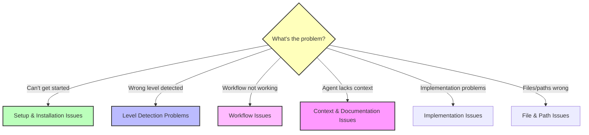

# BMM Troubleshooting Guide

Common issues and solutions for the BMad Method Module.

---

## Quick Diagnosis

**Use this flowchart to find your issue:**



---

## Table of Contents

- [Setup and Installation Issues](#setup-and-installation-issues)
- [Level Detection Problems](#level-detection-problems)
- [Workflow Issues](#workflow-issues)
- [Context and Documentation Issues](#context-and-documentation-issues)
- [Implementation Issues](#implementation-issues)
- [File and Path Issues](#file-and-path-issues)
- [Agent Behavior Issues](#agent-behavior-issues)
- [Integration Issues (Brownfield)](#integration-issues-brownfield)

---

## Setup and Installation Issues

### Problem: BMM not found after installation

**Symptoms:**

- `bmad` command not recognized
- Agent files not accessible
- Workflows don't load

**Solution:**

```bash
# Check if BMM is installed
ls bmad/

# If not present, run installer
npx bmad-method@alpha install

# For fresh install
npx bmad-method@alpha install --skip-version-prompt
```

### Problem: Agents don't have menu

**Symptoms:**

- Load agent file but no menu appears
- Agent doesn't respond to commands

**Solution:**

1. Ensure you're loading the correct agent file path: `bmad/bmm/agents/[agent-name].md`
2. Wait a few seconds for agent to initialize
3. Try asking "show menu" or "help"
4. Check IDE supports Markdown rendering with context
5. For Claude Code: Ensure agent file is open in chat context

### Problem: Workflows not found

**Symptoms:**

- Agent says workflow doesn't exist
- Menu shows workflow but won't run

**Solution:**

1. Check workflow exists: `ls bmad/bmm/workflows/`
2. Verify agent has access to workflow (check agent's workflow list)
3. Try using menu number instead of workflow name
4. Restart chat with agent in fresh session

---

## Level Detection Problems

### Problem: workflow-init suggests wrong level

**Symptoms:**

- Detects Level 3 but you only need Level 1
- Suggests Level 1 but project is actually Level 2
- Can't figure out appropriate level

**Solution:**

1. **Override the suggestion** - workflow-init always asks for confirmation, just say "no" and choose correct level
2. **Be specific in description** - Use level keywords when describing:
   - "fix bug" → Level 0
   - "add small feature" → Level 1
   - "build dashboard" → Level 2
3. **Manual override** - You can always switch levels later if needed

**Example:**

```
workflow-init: "Level 3 project?"
You: "No, this is just adding OAuth login - Level 1"
workflow-init: "Got it, creating Level 1 workflow"
```

### Problem: Project level unclear

**Symptoms:**

- Between Level 1 and Level 2
- Not sure if architecture needed
- Story count uncertain

**Solution:**
**When in doubt, start smaller:**

- Choose Level 1 instead of Level 2
- You can always run `create-prd` later if needed
- Level 1 is faster, less overhead
- Easy to upgrade, hard to downgrade

**Decision criteria:**

- Single epic with related stories? → Level 1
- Multiple independent epics? → Level 2
- Need product-level planning? → Level 2
- Just need technical plan? → Level 1

### Problem: Old planning docs influencing level detection

**Symptoms:**

- Old Level 3 PRD in folder
- Working on new Level 0 bug fix
- workflow-init suggests Level 3

**Solution:**
workflow-init asks: "Is this work in progress or previous effort?"

- Answer: "Previous effort"
- Then describe your NEW work clearly
- System will detect level based on NEW work, not old artifacts

---

## Workflow Issues

### Problem: Workflow fails or hangs

**Symptoms:**

- Workflow starts but doesn't complete
- Agent stops responding mid-workflow
- Progress stalls

**Solution:**

1. **Check context limits** - Start fresh chat for complex workflows
2. **Verify prerequisites**:
   - Phase 2 needs Phase 1 complete (if used)
   - Phase 3 needs Phase 2 complete
   - Phase 4 needs Phase 3 complete (if Level 3-4)
3. **Restart workflow** - Load agent in new chat and restart
4. **Check status file** - Verify `bmm-workflow-status.md` or `sprint-status.yaml` is present and valid

### Problem: Agent says "workflow not found"

**Symptoms:**

- Request workflow by name
- Agent doesn't recognize it
- Menu doesn't show workflow

**Solution:**

1. Check spelling/format - Use exact workflow name or menu shortcut (`*prd` not `*PRD`)
2. Verify agent has workflow:
   - PM agent: prd, tech-spec
   - Architect agent: create-architecture, validate-architecture
   - SM agent: sprint-planning, create-story
3. Try menu number instead of name
4. Check you're using correct agent for workflow

### Problem: Sprint-planning workflow fails

**Symptoms:**

- Can't create sprint-status.yaml
- Epics not extracted from files
- Status file empty or incorrect

**Solution:**

1. **Verify epic files exist**:
   - Level 1: tech-spec with epic
   - Level 2-4: epics.md or sharded epic files
2. **Check file format**:
   - Epic files should be valid Markdown
   - Epic headers should be clear (## Epic Name)
3. **Run in Phase 4 only** - Ensure Phase 2/3 complete first
4. **Check file paths** - Epic files should be in correct output folder

---

## Context and Documentation Issues

### Problem: AI agents lack codebase understanding (Brownfield)

**Symptoms:**

- Suggestions don't align with existing patterns
- Ignores available components
- Proposes approaches that conflict with architecture
- Doesn't reference existing code

**Solution:**

1. **Run document-project** - Critical for brownfield projects
   ```
   Load Analyst agent → run document-project
   Choose scan level: Deep (recommended for PRD prep)
   ```
2. **Verify docs/index.md exists** - This is master entry point for AI agents
3. **Check documentation completeness**:
   - Review generated docs/index.md
   - Ensure key systems are documented
4. **Run deep-dive on specific areas** if needed

### Problem: Have documentation but agents can't find it

**Symptoms:**

- README.md, ARCHITECTURE.md exist
- AI agents still ask questions answered in docs
- No docs/index.md file

**Solution:**
**Option 1: Quick fix (2-5min)**
Run `index-docs` task:

- Located at `bmad/core/tasks/index-docs.xml`
- Scans existing docs and generates index.md
- Lightweight, just creates navigation

**Option 2: Comprehensive (10-30min)**
Run document-project workflow:

- Discovers existing docs in Step 2
- Generates NEW AI-friendly documentation from codebase
- Creates index.md linking to BOTH existing and new docs

**Why this matters:** AI agents need structured entry point (index.md) to navigate docs efficiently.

### Problem: document-project takes too long

**Symptoms:**

- Exhaustive scan running for hours
- Impatient to start planning

**Solution:**
**Choose appropriate scan level:**

- **Quick (2-5min)** - Pattern analysis, no source reading - Good for initial overview
- **Deep (10-30min)** - Reads critical paths - **Recommended for most brownfield projects**
- **Exhaustive (30-120min)** - Reads all files - Only for migration planning or complete understanding

For most brownfield projects, **Deep scan is sufficient**.

---

## Implementation Issues

### Problem: Existing tests breaking (Brownfield)

**Symptoms:**

- Regression test failures
- Previously working functionality broken
- Integration tests failing

**Solution:**

1. **Review changes against existing patterns**:
   - Check if new code follows existing conventions
   - Verify API contracts unchanged (unless intentionally versioned)
2. **Run test-review workflow** (TEA agent):
   - Analyzes test coverage
   - Identifies regression risks
   - Suggests fixes
3. **Add regression testing to DoD**:
   - All existing tests must pass
   - Add integration tests for new code
4. **Consider feature flags** for gradual rollout

### Problem: Story takes much longer than estimated

**Symptoms:**

- Story estimated 4 hours, took 12 hours
- Acceptance criteria harder than expected
- Hidden complexity discovered

**Solution:**
**This is normal!** Estimates are estimates. To handle:

1. **Continue until DoD met** - Don't compromise quality
2. **Document learnings in retrospective**:
   - What caused the overrun?
   - What should we watch for next time?
3. **Consider splitting story** if it's truly two stories
4. **Adjust future estimates** based on this data

**Don't stress about estimate accuracy** - use them for learning, not judgment.

### Problem: Integration points unclear

**Symptoms:**

- Not sure how to connect new code to existing
- Unsure which files to modify
- Multiple possible integration approaches

**Solution:**

1. **For brownfield**:
   - Ensure document-project captured existing architecture
   - Review architecture docs before implementing
2. **Check story file** - Should document integration points
3. **In tech-spec/architecture** - Explicitly document:
   - Which existing modules to modify
   - What APIs/services to integrate with
   - Data flow between new and existing code
4. **Run integration-planning workflow** (Level 3-4):
   - Architect agent creates integration strategy

### Problem: Inconsistent patterns being introduced

**Symptoms:**

- New code style doesn't match existing
- Different architectural approach
- Not following team conventions

**Solution:**

1. **Check convention detection** (Quick Spec Flow):
   - Should detect existing patterns
   - Asks for confirmation before proceeding
2. **Review documentation** - Ensure document-project captured patterns
3. **Use comprehensive story files** - Include pattern guidance in story
4. **Add to code-review checklist**:
   - Pattern adherence
   - Convention consistency
   - Style matching
5. **Run retrospective** to identify pattern deviations early

---

## File and Path Issues

### Problem: Output files in wrong location

**Symptoms:**

- PRD created in wrong folder
- Story files not where expected
- Documentation scattered

**Solution:**
Check `bmad/bmm/config.yaml` for configured paths:

```yaml
output_folder: '{project-root}/docs'
dev_story_location: '{project-root}/docs/stories'
```

Default locations:

- Planning docs (PRD, epics, architecture): `{output_folder}/`
- Stories: `{dev_story_location}/`
- Status files: `{output_folder}/bmm-workflow-status.md`, `{output_folder}/sprint-status.yaml`

To change locations, edit config.yaml then re-run workflows.

### Problem: Can't find status file

**Symptoms:**

- workflow-status says no status file
- Can't track progress
- Lost place in workflow

**Solution:**

1. **Check default location**: `docs/bmm-workflow-status.md`
2. **If missing, reinitialize**:
   ```
   Load Analyst agent → run workflow-init
   ```
3. **For Phase 4**: Look for `sprint-status.yaml` in same folder as PRD
4. **Search for it**:
   ```bash
   find . -name "bmm-workflow-status.md"
   find . -name "sprint-status.yaml"
   ```

### Problem: Sprint-status.yaml not updating

**Symptoms:**

- Workflows complete but status unchanged
- Stories stuck in old status
- Epic status not progressing

**Solution:**

1. **Manual update required** - Most status changes are manual:
   ```yaml
   stories:
     - id: epic-1-story-1
       status: done # Change this manually
   ```
2. **Some workflows auto-update**:
   - sprint-planning creates file
   - create-story changes story to "ready-for-dev"
   - dev-story may auto-update (check workflow)
3. **Re-run sprint-planning** to resync if needed

---

## Agent Behavior Issues

### Problem: Agent provides vague or generic responses

**Symptoms:**

- "Use appropriate framework"
- "Follow best practices"
- Generic advice without specifics

**Solution:**

1. **Provide more context** - Be specific in your description:
   - "Add OAuth using passport.js to Express server"
   - Not: "Add authentication"
2. **For brownfield**:
   - Ensure document-project was run
   - Agent needs codebase context for specific advice
3. **Reference existing docs**:
   - "Based on the existing auth system in UserService..."
4. **Start fresh chat** - Context overload can cause generic responses

### Problem: Agent hallucinating or making up information

**Symptoms:**

- References files that don't exist
- Suggests APIs that aren't in your stack
- Creates imaginary requirements

**Solution:**

1. **Use fresh chat** - Context overflow main cause of hallucinations
2. **Provide concrete constraints**:
   - "We use Express 4.18.2, not Next.js"
   - "Our database is PostgreSQL, not MongoDB"
3. **For brownfield**:
   - Document-project provides factual grounding
   - Agent sees actual code, not assumptions
4. **Correct immediately**:
   - "No, we don't have UserService, we have AuthenticationModule"

### Problem: Agent won't follow instructions

**Symptoms:**

- Ignores specific requests
- Does something different than asked
- Doesn't respect constraints

**Solution:**

1. **Be more explicit** - Agents respond to clear, specific instructions:
   - "Use EXACTLY these three steps..."
   - "Do NOT include database migrations in this story"
2. **Check agent capabilities** - Agent might not have access to requested workflow
3. **Try different phrasing** - Rephrase request to be more direct
4. **Use menu system** - Numbers are clearer than text commands

---

## Integration Issues (Brownfield)

### Problem: New code conflicts with existing architecture

**Symptoms:**

- Integration approach doesn't fit existing structure
- Would require major refactoring
- Conflicts with established patterns

**Solution:**

1. **Check if document-project was run** - Agents need architecture context
2. **Review existing architecture docs**:
   - Read docs/architecture.md (from document-project)
   - Understand current system design
3. **For Level 3-4**:
   - Run validate-architecture workflow before planning
   - Use integration-planning workflow
4. **Explicitly document integration strategy** in architecture:
   - How new components fit existing structure
   - What modifications needed to existing code
   - Migration path if changing patterns

### Problem: Breaking changes to existing APIs

**Symptoms:**

- Changing API breaks consumers
- Downstream services affected
- Need backward compatibility

**Solution:**

1. **Identify all API consumers** (document-project should show this)
2. **Plan versioning strategy**:
   - API v1 (existing) + v2 (new)
   - Deprecation timeline
3. **Use feature flags** for gradual rollout
4. **Document migration guide** for API consumers
5. **Add to testing strategy**:
   - Existing consumers still work (v1)
   - New functionality works (v2)

### Problem: Data migration required

**Symptoms:**

- Schema changes needed
- Existing data needs transformation
- Risk of data loss

**Solution:**

1. **Create explicit migration strategy** in architecture:
   - Forward migration (old → new schema)
   - Rollback plan (new → old schema)
   - Data validation approach
2. **Test migrations thoroughly**:
   - On copy of production data
   - Measure performance impact
3. **Plan rollout**:
   - Staging environment first
   - Gradual production rollout
   - Monitoring for issues
4. **Document in tech-spec/architecture**:
   - Migration scripts
   - Rollback procedures
   - Expected downtime

---

## Still Stuck?

### Getting More Help

If your issue isn't covered here:

1. **Check other documentation**:
   - [FAQ](./faq.md) - Common questions
   - [Glossary](./glossary.md) - Terminology
   - [Quick Start](./quick-start.md) - Basic usage
   - [Brownfield Guide](./brownfield-guide.md) - Existing codebases
   - [Scale Adaptive System](./scale-adaptive-system.md) - Understanding levels

2. **Community support**:
   - [Discord](https://discord.gg/gk8jAdXWmj) - #general-dev, #bugs-issues
   - Active community, fast responses
   - Share your specific situation

3. **Report bugs**:
   - [GitHub Issues](https://github.com/bmad-code-org/BMAD-METHOD/issues)
   - Include version, steps to reproduce, expected vs actual behavior

4. **Video tutorials**:
   - [YouTube Channel](https://www.youtube.com/@BMadCode)
   - Visual walkthroughs of common workflows

---

## Common Error Messages

### "No workflow status file found"

**Cause:** Haven't run workflow-init yet
**Fix:** Load Analyst agent → run workflow-init

### "Epic file not found"

**Cause:** PRD/epics not created, or wrong path
**Fix:** Verify PRD/epics exist in output folder, check config.yaml paths

### "Story not in sprint-status.yaml"

**Cause:** Sprint-planning not run, or story file not created
**Fix:** Run sprint-planning workflow, verify story files exist

### "Documentation insufficient for brownfield"

**Cause:** No docs/index.md or document-project not run
**Fix:** Run document-project workflow with Deep scan

### "Level detection failed"

**Cause:** Ambiguous project description
**Fix:** Be more specific, use level keywords (fix, feature, platform, etc.)

### "Context generation failed"

**Cause:** Missing prerequisites (story file or docs)
**Fix:** Verify story file exists, docs present

---

## Prevention Tips

**Avoid common issues before they happen:**

1. ✅ **Always run document-project for brownfield** - Saves hours of context issues later
2. ✅ **Use fresh chats for complex workflows** - Prevents hallucinations and context overflow
3. ✅ **Verify files exist before running workflows** - Check PRD, epics, stories are present
4. ✅ **Read agent menu before requesting workflows** - Confirm agent has the workflow
5. ✅ **Start with smaller level if unsure** - Easy to upgrade (Level 1 → 2), hard to downgrade
6. ✅ **Keep status files updated** - Manual updates when needed, don't let them drift
7. ✅ **Run retrospectives after epics** - Catch issues early, improve next epic
8. ✅ **Follow phase sequence** - Don't skip required phases (Phase 2 before 3, 3 before 4)

---

**Issue not listed?** Please [report it](https://github.com/bmad-code-org/BMAD-METHOD/issues) so we can add it to this guide!
