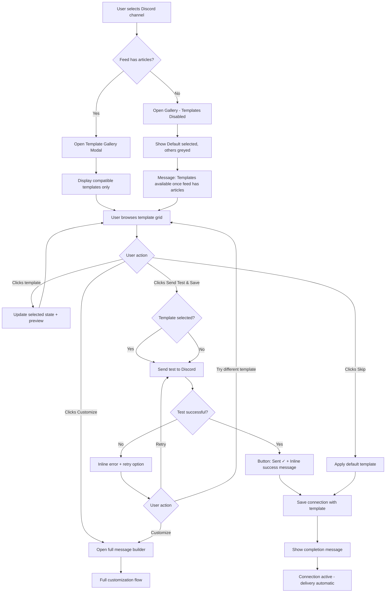
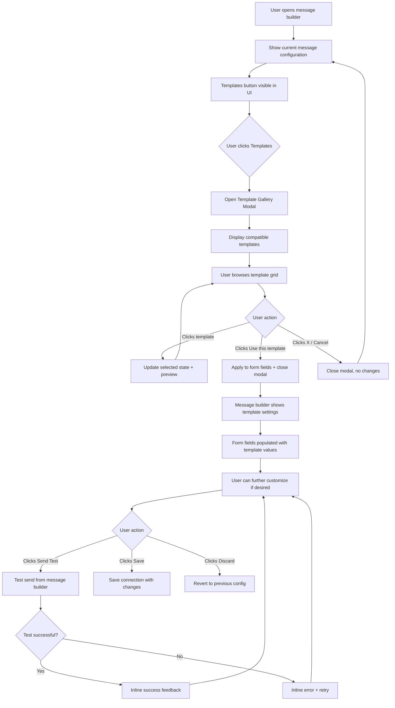
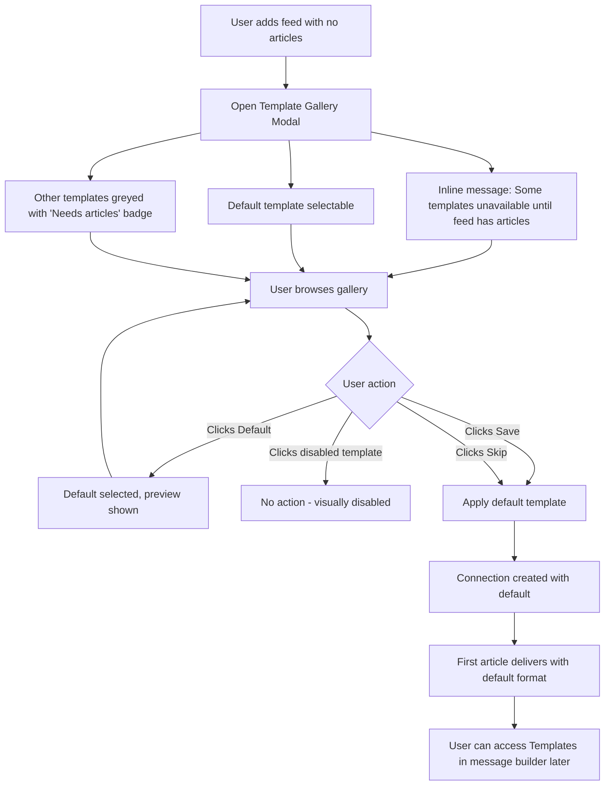

# UX Design Specification MonitoRSS-templates

**Author:** Admin
**Date:** 2025-12-13

---

## Executive Summary

### Project Vision

MonitoRSS provides powerful RSS-to-Discord delivery with deep customization, but this power creates onboarding friction. Users perceive message customization as highly technical due to placeholder syntax and manual configuration requirements. The Template Gallery feature inverts this experience: instead of "here are all the options, figure it out," users simply "pick what looks good and you're done."

The goal is click-and-forget simplicity - users select a professional-looking template and are delivering beautifully formatted messages to Discord in under a minute, without reading documentation or understanding placeholders.

### Target Users

**Primary: New Users (Non-Technical to Mixed)**
- Community managers, server owners, content creators
- Want professional Discord announcements without technical learning curve
- Expect setup to take hours but want to be done in minutes
- Mix of tech-savvy Discord power users and casual community managers
- Use both mobile and desktop devices for configuration

**Secondary: Existing Users**
- Current MonitoRSS users stuck on plain/default formatting
- Know the tool works but haven't invested time in customization
- Looking for a shortcut to better-looking messages
- Will discover templates through message builder UI

**Future: Power Users (Post-MVP)**
- Managing 100+ feeds across multiple Discord servers
- Need consistency and template reuse at scale
- Will benefit from save/share template functionality

### Design North Star

**Design for Alex** - the community manager who budgeted an hour for setup but wants to be done in 3 minutes. Alex represents the least confident user. If Alex succeeds effortlessly, Sam (existing user) and Jordan (power user) will succeed too. Every design decision should be validated against: "Would Alex understand this immediately?"

### Key Design Challenges

1. **Perceived Technical Complexity** - The appearance of placeholders and configuration options creates friction before users even engage. Must hide complexity until users choose to explore it.

2. **Mixed Technical Proficiency** - Serve both non-technical community managers who need simple one-click solutions and tech-savvy users who shouldn't feel patronized. Progressive disclosure is essential.

3. **Cross-Device Responsiveness** - Template gallery with visual previews must work seamlessly on mobile and desktop. Grid layouts and embed previews need careful responsive design.

4. **Feed Capability Variance** - Different feeds have different available fields (some have images, some don't have authors). Templates must be matched to feed capabilities to prevent delivery failures.

5. **Empty Feed Handling** - New feeds without articles cannot be analyzed for capabilities. Must provide clear path forward without breaking the simplified experience or making false promises.

6. **Post-Test-Send Iteration** - Users who send a test and don't like the result need a clear path to try another template. (To be addressed in Core Experience)

### Design Opportunities

1. **Visual Selection Over Configuration** - Present templates as visual choices ("which looks best?") rather than technical options ("configure your embed"). Users decide by appearance, not understanding.

2. **Curated Confidence** - Analyze feed capabilities when articles exist, then filter the template gallery to only show templates guaranteed to work with that specific feed. Users never see a template that could fail them.

3. **Instant Gratification via Opt-Out Test Send** - Make "Send Test" the primary action (opt-out rather than opt-in). Users see their template working in Discord within seconds, validating their choice immediately.

4. **Fearless Exploration** - Explicit "changes don't save until you click Save" messaging and easy discard option removes fear of breaking things, encouraging users to try different templates.

5. **Honest Empty Feed Experience** - For feeds without articles: display full template gallery visually (greyed out/disabled), only default template selectable, with clear messaging: "These templates will be available once your feed has articles." Builds anticipation while being honest about limitations. No proactive prompts needed - the first delivered article speaks for itself.

6. **Bulletproof Default** - Pure-text default template that never fails ensures no dead ends. Users can always proceed, even with edge-case feeds.

## Core User Experience

### Defining Experience

The core experience is **"Pick a template and be done."** The entire Template Gallery feature exists to transform the onboarding moment from "here are all the options, figure it out" to "pick what looks good, you're done."

Template selection during connection setup is the ONE interaction that must be absolutely right. Every design decision flows from making this moment feel instant, confident, and rewarding.

### Platform Strategy

**Platform:** Web application (React 18 + Chakra UI SPA)
**Devices:** Desktop and mobile browsers
**Input:** Mouse/keyboard on desktop, touch on mobile
**Offline:** Not required - always-connected web experience
**Constraints:** Must integrate seamlessly with existing MonitoRSS control panel patterns

The template gallery must be fully responsive, with touch-friendly selection targets on mobile and efficient grid layouts on desktop.

### Effortless Interactions

These interactions must feel like zero thought required:

1. **Browsing templates** - Visual grid with instant understanding of what each template looks like. No reading required, no configuration panels, just pictures.

2. **Selecting a template** - Single click/tap. Template is chosen. No multi-step wizards, no confirmation dialogs, no "are you sure?"

3. **Seeing the result** - Test send shows real output in Discord within seconds. Immediate validation that the choice was right.

4. **Changing your mind** - Try another template freely. Nothing is committed until explicit save. No fear of breaking things or losing work.

5. **Escaping to full control** - If templates don't fit, users can access full customization without starting over or losing context. The door to power-user features is always visible but never forced.

### Critical Success Moments

These are the make-or-break moments that determine whether users succeed or abandon:

1. **Gallery First Impression** - User sees the template grid and thinks "Oh, these actually look good!" not "Ugh, more options to figure out." Visual quality and simplicity must be immediately apparent.

2. **Test Send Result** - User sees their selected template rendered in Discord and thinks "That's exactly what I wanted!" This is the validation moment that builds confidence and trust.

3. **First Real Article Delivery** - The template works flawlessly when the first real article arrives. No failures, no "this doesn't look like the preview" surprises. The promise is kept.

4. **Post-Test-Send Iteration** - If the user doesn't like the test result, they can easily try another template or escape to full customization. No dead ends, no frustration.

### Experience Principles

These principles guide all UX decisions for the Template Gallery:

1. **Visual First, Always** - Show, don't tell. Users choose by looking, not by reading or configuring. If it requires explanation, simplify it.

2. **One Click to Value** - Every interaction should move the user closer to "done." Eliminate steps, confirmations, and intermediate states wherever possible.

3. **Confidence Through Honesty** - Only show templates that will work. Only promise what we can deliver. Build trust by never surprising users with failures.

4. **Power Available, Never Required** - Simple path is default and optimized. Full customization is always accessible but never forced. Progressive disclosure lets users go deeper when they choose to.

5. **Instant Feedback, Always** - Every action has immediate, visible response. Test sends, previews, and selections all provide instant confirmation that the system heard the user.

## Desired Emotional Response

### Primary Emotional Goals

**Core Emotional Arc:** Anxiety → Surprised Ease → Confidence

Users arrive expecting complexity and leave feeling accomplished. The primary emotional goal is to create a "wait, that's it?" moment - the gap between expected difficulty and actual ease. This emotional surprise is what makes users tell friends: "You won't believe how easy this was."

**Primary Emotion:** Confident accomplishment - "I did it, and it looks professional"
**Secondary Emotion:** Pleasant surprise - "That was way easier than I expected"
**Differentiating Emotion:** Relief - Unlike other tools, this didn't make me feel stupid

### Emotional Journey Mapping

| Stage | Desired Emotion | Design Implication |
|-------|-----------------|-------------------|
| **First Discovery** | Curiosity, hope | Visual gallery immediately signals "this is different" |
| **Browsing Templates** | Delight, relief | Beautiful options without overwhelming configuration |
| **Selecting a Template** | Confidence | One click, no second-guessing required |
| **Test Send Result** | Pride, validation | "That's exactly what I wanted!" moment |
| **Something Goes Wrong** | Calm, capability | Clear path forward, no dead ends |
| **Returning Later** | Familiarity, empowerment | Easy to find, easy to change |

### Micro-Emotions

**Emotions to Cultivate:**
- **Confidence over Confusion** - Every element should feel obvious
- **Trust over Skepticism** - What you see is what you get (preview matches reality)
- **Accomplishment over Frustration** - Quick wins, visible progress
- **Delight over Mere Satisfaction** - Exceed expectations, don't just meet them

**Emotions to Actively Prevent:**
- **Overwhelm** - Too many options, too much text, too many decisions
- **Self-doubt** - "Am I doing this right?" should never cross their mind
- **Fear of breaking things** - Reversibility must be obvious
- **Abandonment** - No dead ends, always a path forward

### Design Implications

| Emotional Goal | UX Design Approach |
|----------------|-------------------|
| Surprised ease | Hide complexity by default; visual selection over configuration |
| Confidence | Curated gallery (only show what works); clear primary actions |
| Pride in result | High-quality template designs; test send for immediate validation |
| Calm during errors | Friendly error messages; obvious recovery paths; bulletproof default |
| Trust | Preview fidelity (what you see = what you get); honest empty-feed messaging |
| Delight | Polish in micro-interactions; professional template aesthetics |

### Emotional Design Principles

1. **Exceed Expectations, Don't Meet Them** - Users expect this to be hard. Make it shockingly easy. The emotional payoff comes from the gap between expectation and reality.

2. **Confidence is Built, Not Assumed** - Every interaction should add to the user's sense of "I've got this." Never make them question if they're doing it right.

3. **Errors Are Moments, Not Failures** - When something goes wrong, the user should feel capable of fixing it, not defeated. Design errors as temporary detours, not dead ends.

4. **Delight Lives in the Details** - The difference between "fine" and "wow" is in micro-interactions, visual polish, and moments of unexpected ease.

5. **Trust Through Transparency** - Show exactly what will happen. Preview matches delivery. No surprises, no "that's not what I expected."

## UX Pattern Analysis & Inspiration

### Inspiring Products Analysis

**Canva (Template Selection)**
Visual grid of templates with instant preview. Users browse by looking, not reading. One click to select, then customize. The "pick visually, done immediately" flow directly informs our template gallery design.

**Notion (Progressive Disclosure)**
Simple by default, power features revealed on demand. New users see clean interface; power users discover depth over time. Informs our "templates as primary path, full customization as escape hatch" approach.

**Slack Block Kit Builder (Live Preview)**
Side-by-side editing and preview. Changes reflect instantly. What you see is what you get. Template preview must match Discord output exactly with instant feedback.

**Discohook (Discord-Native Patterns)**
Familiar Discord embed styling. Users immediately recognize how output will look in their server. Our preview must use Discord's actual visual language - colors, fonts, embed structure.

### Transferable UX Patterns

**Selection Patterns:**
- Visual grid with hover state - template gallery layout
- Single-click selection without confirmation - template application
- Clear "selected" state with visual indicator - current template feedback

**Feedback Patterns:**
- Live preview panel showing Discord embed as user browses
- Skeleton loading states while preview fetches
- Success animation/toast after test send completes

**Progressive Disclosure Patterns:**
- "Customize" as subtle link, not prominent button - escape to full editor
- Tooltips on hover for template feature explanation
- No visible configuration until user explicitly requests it

**Safety Patterns:**
- "Changes not saved until you click Save" messaging
- Easy discard/undo to return to previous state
- Non-destructive preview browsing

### Anti-Patterns to Avoid

- **Multi-step wizards** - Creates friction, implies complexity
- **Confirmation dialogs** - Signals danger, slows users down
- **Upfront customization options** - Triggers "this is technical" fear
- **Visible placeholder syntax** - Exposes complexity before value
- **Small touch targets** - Fails on mobile (minimum 44x44px required)
- **Blocking loading states** - Use skeleton states for progressive loading

### Design Inspiration Strategy

**Adopt Directly:**
- Visual grid selection from Canva - core gallery layout
- Single-click apply pattern - no confirmation dialogs
- Discord-native preview styling from Discohook
- Success celebration feedback from Linear

**Adapt for Context:**
- Live preview simplified for read-only browsing (not editing)
- Progressive disclosure via escape hatch (not tabs within gallery)
- Skeleton loading for preview fetch only

**Avoid Entirely:**
- Multi-step wizards
- Confirmation dialogs for reversible actions
- Visible placeholder syntax in gallery
- Configuration before selection

## Design System Foundation

### Design System Choice

**Chakra UI** - Continuing with the existing MonitoRSS design system.

This is a brownfield project extending an existing React 18 + Chakra UI application. The Template Gallery must integrate seamlessly with the current MonitoRSS control panel, making Chakra UI the only appropriate choice.

### Rationale for Selection

- **Consistency** - Matches existing MonitoRSS UI patterns and visual language
- **No Learning Curve** - Team already uses Chakra UI throughout the application
- **Built-in Accessibility** - WCAG compliance, keyboard navigation, ARIA support, focus management
- **Responsive by Default** - Built-in responsive props support mobile and desktop requirements
- **Component Coverage** - Grid, Card, Button, Modal, Skeleton components cover all gallery needs

### Implementation Approach

**Core Chakra Components for Template Gallery:**
- `SimpleGrid` / `Grid` - Responsive template gallery layout
- `Box` / `Card` - Template cards with visual preview
- `Button` - Primary actions (Send Test, Save, Skip, Customize)
- `Skeleton` - Loading states while preview fetches
- `Modal` or drawer pattern - Gallery presentation during connection flow
- `useToast` - Success feedback after test send
- Existing form components for any configuration needed

**Integration Points:**
- Template gallery integrates into existing connection creation flow
- Message builder UI gains "Templates" button for existing connections
- Preview component reuses existing message preview infrastructure

### Customization Strategy

**Standard Chakra (No Customization):**
- Button styles, form elements, spacing scale
- Typography and color palette (existing theme)
- Modal/drawer behavior and animations
- Toast notifications

**Reuse Existing:**
- **Discord Embed Preview** - Existing message builder preview component, already matches Discord's visual language

**Custom Styling Required:**
- **Template Card States** - Hover, selected, disabled states need clear visual feedback for gallery UX
- **Gallery Grid Breakpoints** - Optimize responsive layout for template preview visibility at different screen sizes
- **Empty/Disabled State** - Greyed-out templates for empty feeds need clear but non-intrusive styling

## Defining Experience

### Core Interaction

**"Pick a template, see it work in Discord"**

This is the defining experience users will describe to friends: "I just picked one that looked good and it was already sending to my Discord." The entire feature succeeds or fails based on making this moment feel instant, confident, and magical.

### User Mental Model

**Current Approach (What We're Replacing):**
- Manual placeholder configuration (`{title}`, `{description}`, etc.)
- Copy-paste from documentation or Discord communities
- Trial and error with repeated test sends
- Frequent outcome: give up and accept defaults

**Mental Model Users Bring:**
- "This will be technical" → Creates anxiety before engagement
- "I'll need to learn something" → Resistance to starting
- "I might break it" → Fear of making mistakes

**Expected Interaction:**
- Visual selection like choosing a theme, filter, or wallpaper
- Immediate preview of the exact output they'll get
- One action to apply, not a sequence of configurations

### Success Criteria

Users know the experience succeeded when:
- They can browse templates without reading any instructions
- Selection feels like a single decision, not a process
- Test send delivers exactly what the preview showed
- They feel done, not like there's more to configure
- They tell someone: "You won't believe how easy this was"

**Measurable Indicators:**
- Template selection completed in under 60 seconds
- Test send matches preview with 100% fidelity
- Zero support questions from users who complete the flow

### Novel UX Patterns

**Established Patterns (No Education Needed):**
- Visual grid selection - familiar from Canva, themes, filters
- One-click application - standard for template tools
- Live preview - expected in any modern template experience

**Contextual Innovation (Our Differentiators):**
- **Curated Gallery** - Filter to only show compatible templates based on feed capabilities (prevents failures)
- **Opt-Out Test Send** - Validation is the primary action, skipping is secondary (inverts typical patterns)
- **Honest Empty State** - Show but disable templates for empty feeds with clear messaging (builds trust)

### Experience Mechanics

**Flow Sequence:**

| Phase | User Action | System Response | Success Signal |
|-------|-------------|-----------------|----------------|
| **Initiation** | Reaches template step in connection flow | Gallery appears with compatible templates | "These all look professional" |
| **Browse** | Scrolls/views template grid | Preview updates to show selected template | "I can see exactly what I'll get" |
| **Select** | Clicks/taps a template card | Card shows selected state | "That was easy" |
| **Validate** | Clicks "Send Test" (primary button) | Test article appears in Discord | "That's exactly what I wanted!" |
| **Complete** | Clicks "Save" or "Done" | Connection activated with template | "I'm done. That was fast." |

**Error Recovery Paths:**
- Don't like test result → Try another template (gallery still open)
- No template fits → "Customize" link to full editor
- Test send fails → Friendly error + retry option
- Empty feed → Default template only, others visible but disabled

**Completion Signals:**
- Success message: "You're all set! New articles will be delivered automatically."
- Clear finality - no lingering uncertainty about whether more is needed
- Breadcrumb for future: "Change this anytime from your connection settings"

## Visual Design Foundation

### Color System

**Inherited from MonitoRSS Chakra UI Theme**

The Template Gallery uses the existing MonitoRSS color system. No new colors are introduced.

**Semantic Color Usage for Template Gallery:**
- **Primary** - Template selection actions (Send Test, Save)
- **Secondary/Subtle** - Skip, Customize links
- **Success** - Test send success toast, completion confirmation
- **Error** - Test send failure, error states
- **Disabled/Muted** - Greyed-out templates for empty feeds

### Typography System

**Inherited from MonitoRSS Chakra UI Theme**

Standard application typography applies throughout the Template Gallery.

**Key Typography Applications:**
- **Headings** - Gallery title ("Choose a template"), section labels
- **Body** - Template names, descriptions, messaging
- **Caption/Small** - Helper text, "Changes not saved until you click Save"

### Spacing & Layout Foundation

**Inherited from MonitoRSS Chakra UI Theme**

Uses existing Chakra UI spacing scale and layout patterns.

**Template Gallery-Specific Layout:**
- **Grid Layout** - Responsive grid for template cards (2-3 columns desktop, 1-2 mobile)
- **Card Spacing** - Consistent gaps between template cards using Chakra spacing scale
- **Touch Targets** - Minimum 44x44px for mobile accessibility
- **Preview Area** - Sufficient space for Discord embed preview visibility

### Accessibility Considerations

**Chakra UI Built-in Accessibility:**
- Keyboard navigation for template grid (arrow keys, Enter to select)
- Focus indicators on template cards
- ARIA labels for selected/disabled states
- Screen reader announcements for selection changes

**Template Gallery-Specific Accessibility:**
- Clear visual distinction between selected, hover, and disabled template states
- High contrast for disabled template messaging
- Focus management when gallery opens/closes
- Accessible loading states with aria-busy

## Design Direction

### Design Directions Considered

Since this is a brownfield project extending MonitoRSS with an established visual language, design direction exploration focused on **layout and presentation** rather than visual style variations.

**Options Evaluated:**

1. **Inline Gallery** - Template gallery appears inline within connection creation flow, scrolling naturally with page
2. **Modal Gallery** - Template gallery opens as focused modal/overlay experience
3. **Drawer/Sidebar Gallery** - Template gallery slides in from side while main content remains visible

### Chosen Direction

**Modal Gallery** - Template selection presented as a focused modal experience.

### Design Rationale

- **Focused Experience** - Modal creates a distinct "moment" for template selection, matching our emotional goal of making this feel like an important but easy decision
- **Visual Clarity** - Full attention on template grid and preview without competing UI elements
- **Mobile-Friendly** - Modal pattern translates well to mobile devices (full-screen on small viewports)
- **Preview Space** - Ample room for template grid alongside Discord embed preview
- **Existing Patterns** - Consistent with MonitoRSS's likely use of modals for focused tasks
- **Clear Entry/Exit** - Obvious open/close behavior supports "fearless exploration" principle

### Layout Structure

**Modal Gallery Layout:**
```
┌─────────────────────────────────────────────────────────┐
│  Choose a Template                              [X]     │
├─────────────────────────────────────────────────────────┤
│                                                         │
│  ┌─────────┐  ┌─────────┐  ┌─────────┐                 │
│  │ Template│  │ Template│  │ Template│   ┌───────────┐ │
│  │    1    │  │    2    │  │    3    │   │  Preview  │ │
│  │         │  │ ✓ Selected│ │         │   │           │ │
│  └─────────┘  └─────────┘  └─────────┘   │  Discord  │ │
│                                           │   Embed   │ │
│  ┌─────────┐  ┌─────────┐  ┌─────────┐   │           │ │
│  │ Template│  │ Template│  │ Default │   │           │ │
│  │    4    │  │    5    │  │ (safe)  │   └───────────┘ │
│  └─────────┘  └─────────┘  └─────────┘                 │
│                                                         │
├─────────────────────────────────────────────────────────┤
│  [Customize manually]     [Skip]  [Send Test & Save]   │
└─────────────────────────────────────────────────────────┘
```

**Key Layout Elements:**
- Template grid on left (responsive columns)
- Preview panel on right (reuses existing component)
- Action buttons at bottom with clear hierarchy
- "Customize manually" as subtle link (escape hatch)
- "Send Test & Save" as primary action (opt-out pattern)

### Implementation Notes

- Use Chakra UI `Modal` component with appropriate size (xl or full on mobile)
- Grid layout adjusts columns based on viewport (3 columns desktop, 2 tablet, 1 mobile)
- Preview panel may stack below grid on narrow viewports
- Focus trapped within modal for accessibility
- ESC key closes modal (returns to previous state without saving)

## User Journey Flows

### Journey 1: New User Template Selection (Alex)

**Entry Point:** User completes Discord channel selection in connection creation flow



**Key Flow Elements:**
- Feed capability check before gallery display
- Compatible templates only shown (curated confidence)
- Test send is the primary action (opt-out pattern)
- Inline feedback (not toasts) for success/error states
- Multiple recovery paths from errors

### Journey 2: Existing User Template Access (Sam)

**Entry Point:** User opens message builder for existing connection



**Key Flow Elements:**
- Modal is a template picker with browse-then-apply pattern
- Click template to preview, explicit button to apply
- Selecting applies to form fields and closes modal
- All save/test/discard actions in message builder (no nested save states)
- Supports fearless exploration of templates

### Journey 3: Empty Feed Flow

**Entry Point:** User adds a feed with no articles yet



**Key Flow Elements:**
- Inline banner message at top explains the situation
- "Needs articles" badge on each disabled template card
- No tooltip required - information visible without interaction
- Works on mobile/touch devices
- Default template always works (bulletproof)

### Journey Patterns

**Navigation Patterns:**
- Modal gallery for focused template selection
- Single entry point per context (connection flow vs message builder)
- Clear exit paths (Cancel, X, or complete action)

**Selection Patterns:**
- Click to preview, explicit action to apply
- Visual selected state with preview update
- Compatible templates only (curated based on feed)

**Feedback Patterns:**
- Inline feedback within modal/view (not toasts)
- Button state changes for immediate confirmation (Sending... → Sent ✓)
- Persistent success/error messages until user acts
- Clear error recovery options

**Safety Patterns:**
- No nested save states (modal doesn't have its own save)
- Changes preview in modal, apply to form on explicit action
- Message builder's Save/Discard handles persistence

## Component Strategy

### Design System Components (Chakra UI)

The Template Gallery leverages existing Chakra UI components for the majority of the interface:

| Component | Usage |
|-----------|-------|
| `Modal` + `ModalCloseButton` | Gallery container with accessible close |
| `SimpleGrid` | Responsive template card layout |
| `Box` | Container and layout components |
| `Button` (with `isLoading`) | Actions (Send Test, Save, Skip, Use this template) |
| `Skeleton` | Loading states while preview fetches |
| `Text` / `Heading` | Gallery title, template names, messages |
| `Badge` | "Needs articles" label on disabled templates |
| `Alert` | Inline feedback for success/error messages |

### Existing Components (Reuse)

| Component | Usage |
|-----------|-------|
| Discord Embed Preview | Reuse existing message builder preview component for template preview |

### Custom Components

#### TemplateCard

**Purpose:** Display a template option in the gallery grid with selection and disabled states.

**Content:**
- Template name
- Thumbnail preview (simplified Discord embed visualization)
- Optional "Needs articles" badge (disabled state)

**States:**

| State | Visual Treatment |
|-------|------------------|
| **Default** | Subtle border, pointer cursor |
| **Hover** | Highlighted border, slight elevation/shadow |
| **Selected** | Primary color border, checkmark indicator |
| **Disabled** | Greyed out, "Needs articles" badge, not-allowed cursor |

**Accessibility:**
- `role="option"` within `role="listbox"` container
- `aria-selected="true/false"` for selection state
- `aria-disabled="true"` for disabled templates
- Keyboard navigation: Arrow keys to navigate, Enter/Space to select
- Focus indicator visible on keyboard navigation

**Implementation Notes:**
- Build using Chakra `Box` with custom styling for states
- Use Chakra's `useColorModeValue` for light/dark theme support
- Transition animations for hover/selection states

### Component Implementation Strategy

**Approach:**
- Maximize use of Chakra UI components with existing MonitoRSS theme
- Single custom component (TemplateCard) built using Chakra primitives
- Reuse existing Discord preview component without modification
- Follow existing codebase patterns for component structure

**Implementation Phases:**

| Phase | Components | Dependency |
|-------|------------|------------|
| **Phase 1** | TemplateCard, Modal integration | Core gallery functionality |
| **Phase 2** | Inline feedback patterns | Success/error states |
| **Phase 3** | Loading states, skeleton | Polish and perceived performance |

## UX Consistency Patterns

### Button Hierarchy

| Level | Usage | Style | Examples |
|-------|-------|-------|----------|
| **Primary** | Main action user should take | Solid, primary color | "Send Test & Save", "Use this template" |
| **Secondary** | Alternative valid actions | Outlined or ghost | "Skip", "Save", "Cancel" |
| **Tertiary** | Escape hatches, less common actions | Link style, subtle | "Customize manually" |

**Placement Rule:** Primary action on right, secondary in middle, tertiary on left.

**Loading State:** Primary buttons show `isLoading` state with spinner and "Sending..." text while processing.

### Feedback Patterns

| Feedback Type | Component | Behavior |
|---------------|-----------|----------|
| **Loading** | Button `isLoading` state | "Sending..." with spinner, button disabled |
| **Success** | `Alert` (success variant) | Inline below preview, persists until user acts |
| **Error** | `Alert` (error variant) | Inline below preview, includes retry action |
| **Info** | `Alert` (info variant) | Contextual messages (e.g., empty feed banner) |

**Key Rule:** No toasts. All feedback is inline and persistent until user takes next action.

**Error Recovery:** All error states include clear recovery action (Retry, Try different template, or Customize manually).

### Modal Patterns

| Aspect | Pattern |
|--------|---------|
| **Size** | XL on desktop, full-screen on mobile |
| **Close mechanisms** | X button, ESC key, click outside (if no pending changes) |
| **Focus management** | Trapped within modal, returns to trigger element on close |
| **Scrolling** | Gallery content scrolls internally, header/footer remain fixed |
| **Backdrop** | Dimmed background, click to close |

**Entry Animation:** Fade in + slight scale up (Chakra default)
**Exit Animation:** Fade out (Chakra default)

### Selection Patterns

| Interaction | Response |
|-------------|----------|
| **Click template card** | Update selected state + update preview panel |
| **Click "Use this template"** | Apply selection to form + close modal |
| **Click disabled template** | No action (visually unresponsive) |
| **Keyboard: Arrow keys** | Navigate between template cards |
| **Keyboard: Enter/Space** | Select currently focused template |
| **Keyboard: Tab** | Move focus between cards and action buttons |

**Visual Feedback:**
- Hover: Border highlight + subtle elevation
- Selected: Primary color border + checkmark indicator
- Focus: Visible focus ring (accessibility)

### Empty and Disabled States

| State | Visual Treatment | Messaging |
|-------|------------------|-----------|
| **Empty feed (no articles)** | Templates greyed out with badge | "Needs articles" badge on each disabled card |
| **Empty feed banner** | Info Alert at modal top | "Some templates are unavailable until your feed has articles" |
| **Loading gallery** | Skeleton template cards | Placeholder card shapes while fetching |
| **Loading preview** | Skeleton in preview area | Placeholder while preview renders |

**Disabled Interaction:** Disabled templates show `cursor: not-allowed` and do not respond to clicks or keyboard selection.

### Pattern Integration with Chakra UI

All patterns leverage Chakra UI components with minimal customization:

| Pattern | Chakra Component |
|---------|------------------|
| Button hierarchy | `Button` with variant props (solid, outline, ghost, link) |
| Feedback | `Alert` with status props (success, error, info) |
| Modal | `Modal` with size and closeOnOverlayClick props |
| Loading | `Button` isLoading + `Skeleton` |
| Selection states | Custom styling on `Box` (TemplateCard component) |

## Responsive Design & Accessibility

### Responsive Strategy

Leverages Chakra UI's built-in responsive system for the Template Gallery.

**Viewport Adaptations:**

| Viewport | Modal Size | Grid Columns | Preview Position |
|----------|-----------|--------------|------------------|
| **Desktop** (1024px+) | XL (max-width container) | 3 columns | Side-by-side with grid |
| **Tablet** (768px-1023px) | Large | 2 columns | Side-by-side or stacked |
| **Mobile** (<768px) | Full-screen | 1 column | Stacked below grid |

**Key Adaptations:**
- Modal becomes full-screen on mobile for focused experience
- Template cards resize but maintain minimum touch target size (44x44px)
- Preview panel stacks below grid on narrow viewports
- Action buttons stack vertically on mobile if needed

### Breakpoint Strategy

**Use Chakra UI default breakpoints:**

| Breakpoint | Size | Usage |
|------------|------|-------|
| `sm` | 480px | Small phones |
| `md` | 768px | Tablets, large phones |
| `lg` | 992px | Small desktops |
| `xl` | 1280px | Large desktops |

**Approach:** Mobile-first. Base styles for mobile, progressive enhancement for larger screens.

### Accessibility Strategy

**Target:** WCAG 2.1 Level AA compliance (industry standard)

**Chakra UI Provides:**
- Color contrast compliance
- Focus visible states
- Reduced motion support (`prefers-reduced-motion`)
- Screen reader friendly components

**Template Gallery Accessibility:**

| Requirement | Implementation |
|-------------|----------------|
| **Semantic Structure** | Radio button group with visually hidden inputs, cards as styled labels |
| **Keyboard Navigation** | Arrow keys navigate options, Tab moves to action buttons |
| **Focus Management** | Trap focus in modal, return to trigger on close |
| **Screen Reader** | Native radio semantics - no custom ARIA required |
| **Touch Targets** | Minimum 44x44px for all interactive elements |
| **Color Independence** | Selection indicated by border + checkmark (not color alone) |

**Radio Button Implementation:**
```html
<fieldset>
  <legend class="visually-hidden">Choose a template</legend>

  <input type="radio" name="template" id="template-1" class="visually-hidden" />
  <label for="template-1">
    <!-- TemplateCard visual content -->
  </label>

  <input type="radio" name="template" id="template-2" class="visually-hidden" />
  <label for="template-2">
    <!-- TemplateCard visual content -->
  </label>
</fieldset>
```

**Benefits:**
- Native keyboard navigation (arrow keys between options)
- Built-in screen reader support
- No custom ARIA attributes needed
- Form-compatible if needed

### Testing Strategy

**Responsive Testing:**
- Chrome DevTools device emulation
- Real device testing (iOS Safari, Android Chrome)
- Chakra UI responsive props verification

**Accessibility Testing:**
- Keyboard-only navigation test (Tab, Arrow keys, Enter)
- Screen reader testing (VoiceOver on Mac/iOS, NVDA on Windows)
- Automated testing with axe-core
- Color contrast verification
- Focus indicator visibility check
